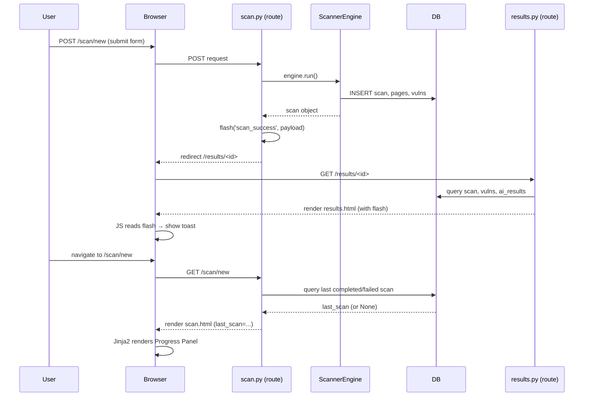

# Design Document: Scan Notification và Previous Scan Progress Panel

## Overview

Feature này bổ sung hai cải tiến UX cho trang **New Scan** (`/scan/new`) của AI Web Vulnerability Scanner:

1. **Scan Completion Notification** — Toast notification xuất hiện trên trang Results ngay sau khi scan hoàn tất, thông báo kết quả (thành công/thất bại) và số lỗ hổng tìm được.
2. **Previous Scan Progress Panel** — Panel tóm tắt kết quả lần scan gần nhất, hiển thị bên dưới form cấu hình scan trên trang New Scan.

Cả hai tính năng đều không yêu cầu thay đổi database schema. Chúng tận dụng:
- **Flask `flash()`** để truyền thông báo qua redirect (POST → GET).
- **Jinja2 template variables** để render dữ liệu scan gần nhất.
- **Vanilla JavaScript** để hiển thị và tự động ẩn toast.
- **SQLAlchemy query** đơn giản để lấy scan record mới nhất.

---

## Architecture

### Luồng dữ liệu tổng thể



### Các thành phần bị ảnh hưởng

| Thành phần | Loại thay đổi | Mô tả |
|---|---|---|
| `app/routes/scan.py` | Modify | Thêm `flash()` sau scan thành công/thất bại; thêm query `last_scan` cho GET |
| `app/routes/results.py` | No change | Không cần thay đổi — flash messages được đọc tự động bởi Jinja2 |
| `templates/scan.html` | Modify | Thêm Progress Panel block bên dưới form |
| `templates/base.html` | Modify | Thêm Toast container và JS logic |
| `app/static/css/style.css` | Modify | Thêm styles cho toast và progress panel |
| `app/static/js/main.js` | Modify | Thêm `initToastNotifications()` function |

---

## Components and Interfaces

### Component 1: Toast Notification System

**Vị trí**: `templates/base.html` + `app/static/js/main.js` + `app/static/css/style.css`

Toast được render server-side thông qua Jinja2 đọc `get_flashed_messages(with_categories=True)`, sau đó JavaScript xử lý auto-dismiss và close button.

**HTML structure** (trong `base.html`, trước `</body>`):

```html
<!-- Toast Container -->
<div id="toast-container" class="toast-container">
  
    
      
      <div class="toast toast--{{ 'success' if category == 'scan_success' else 'error' }}"
           data-auto-dismiss="5000">
        <div class="toast-icon">
          <i data-lucide="{{ 'check-circle' if category == 'scan_success' else 'x-circle' }}"></i>
        </div>
        <div class="toast-body">
          <p class="toast-title">
            {{ 'Scan Complete' if category == 'scan_success' else 'Scan Failed' }}
          </p>
          <p class="toast-message">{{ message }}</p>
        </div>
        <button class="toast-close" aria-label="Dismiss notification">
          <i data-lucide="x"></i>
        </button>
      </div>
      
    
  
</div>
```

**Flash message payload format**:
- `scan_success`: `"Scanned <target_url> — <N> vulnerabilit(y/ies) found."`
- `scan_error`: `"Scan failed for <target_url>: <error_message>"`

**JavaScript interface** (`initToastNotifications` trong `main.js`):

```javascript
function initToastNotifications() {
    // Selects all .toast elements, attaches close handler,
    // and schedules auto-dismiss via setTimeout
}
```

### Component 2: Previous Scan Progress Panel

**Vị trí**: `templates/scan.html` (block mới bên dưới form)

Panel được render hoàn toàn server-side bởi Jinja2. Không có JavaScript riêng cho component này.

**Template variable**: `last_scan` — đối tượng `Scan` ORM hoặc `None`.

**Conditional rendering logic**:
- `last_scan is None` → hiển thị placeholder "No previous scans"
- `last_scan.status == 'completed'` và `total_vulnerabilities > 0` → badge màu đỏ/cam
- `last_scan.status == 'completed'` và `total_vulnerabilities == 0` → badge màu xanh lá
- `last_scan.status == 'failed'` → badge màu đỏ với text "Scan Failed"

### Component 3: Last Scan Query (Route Layer)

**Vị trí**: `app/routes/scan.py`

```python
def _get_last_scan():
    """Return the most recent completed or failed scan, or None."""
    try:
        return (
            Scan.query
            .filter(Scan.status.in_(['completed', 'failed']))
            .order_by(Scan.completed_at.desc())
            .first()
        )
    except Exception as exc:
        logger.error("Failed to fetch last scan: %s", exc)
        return None
```

---

## Data Models

Không có thay đổi schema database. Feature này chỉ đọc dữ liệu từ model `Scan` hiện có:

```python
class Scan(db.Model):
    id: int                    # PK — dùng cho "View Full Results" link
    target_url: str            # Hiển thị trong panel và toast
    status: str                # 'completed' | 'failed' — điều kiện render badge
    completed_at: datetime     # ORDER BY để lấy scan mới nhất
    total_pages: int           # Hiển thị trong panel
    total_forms: int           # Hiển thị trong panel
    total_vulnerabilities: int # Hiển thị trong panel và toast
```

**Query pattern** (single query, không N+1):

```python
last_scan = (
    Scan.query
    .filter(Scan.status.in_(['completed', 'failed']))
    .order_by(Scan.completed_at.desc())
    .first()
)
```

---

## Correctness Properties

*A property is a characteristic or behavior that should hold true across all valid executions of a system — essentially, a formal statement about what the system should do. Properties serve as the bridge between human-readable specifications and machine-verifiable correctness guarantees.*

### Property Reflection

Sau khi phân tích prework, các properties sau được xác định là có giá trị kiểm thử độc lập:

- **P1** (từ 1.5): Toast luôn có close button — bao quát cả success và error toast.
- **P2** (từ 2.1 + 2.3): Panel hiển thị đầy đủ dữ liệu cho bất kỳ completed scan nào — P2 bao gồm cả P1 của requirement 2.
- **P3** (từ 2.4): Badge severity xuất hiện khi có lỗ hổng — là subset của P2 nhưng kiểm tra điều kiện cụ thể.
- **P4** (từ 2.7): Link "View Full Results" luôn trỏ đúng scan ID.
- **P5** (từ 3.1): Query luôn trả về scan có `completed_at` mới nhất.
- **P6** (từ 4.2 + 4.4): Flash message luôn sinh ra toast với đúng nội dung.

Properties P2 và P3 không redundant vì P3 kiểm tra điều kiện `total_vulnerabilities > 0` riêng biệt. P1 và P6 không redundant vì P1 kiểm tra cấu trúc HTML còn P6 kiểm tra nội dung.

---

### Property 1: Toast luôn có close button

*For any* flash message thuộc category `'scan_success'` hoặc `'scan_error'`, toast được render ra phải luôn chứa một phần tử close button có thể tương tác.

**Validates: Requirements 1.5**

---

### Property 2: Progress Panel hiển thị đầy đủ các trường của last scan

*For any* đối tượng `Scan` với `status` là `'completed'` hoặc `'failed'` được truyền vào template `scan.html` dưới tên `last_scan`, HTML được render phải chứa đầy đủ 6 trường: `target_url`, `status`, `total_pages`, `total_forms`, `total_vulnerabilities`, và `completed_at`.

**Validates: Requirements 2.1, 2.3**

---

### Property 3: Severity badge xuất hiện khi scan có lỗ hổng

*For any* `Scan` object với `status = 'completed'` và `total_vulnerabilities > 0`, HTML được render bởi Progress Panel phải chứa một phần tử severity badge (element có class `panel-badge--danger` hoặc tương đương).

**Validates: Requirements 2.4**

---

### Property 4: Link "View Full Results" luôn trỏ đúng scan ID

*For any* `Scan` object với `id = N` được truyền vào template, Progress Panel phải chứa một thẻ `<a>` có `href` kết thúc bằng `/results/N`.

**Validates: Requirements 2.7**

---

### Property 5: Query last scan luôn trả về scan có completed_at mới nhất

*For any* tập hợp các `Scan` records trong database với các giá trị `completed_at` khác nhau, hàm `_get_last_scan()` phải trả về record có `completed_at` lớn nhất trong số các records có `status IN ('completed', 'failed')`.

**Validates: Requirements 3.1**

---

### Property 6: Flash message luôn sinh ra toast với đúng nội dung

*For any* flash message thuộc category `'scan_success'` chứa một số nguyên N là vulnerability count, HTML được render bởi `base.html` phải chứa một toast element hiển thị số N đó. Tương tự, *for any* flash message thuộc category `'scan_error'`, phải có toast với visual indicator lỗi.

**Validates: Requirements 4.2, 4.4**

---

## Error Handling

| Tình huống | Xử lý |
|---|---|
| DB query `_get_last_scan()` raise exception | Log error, trả về `None`; trang vẫn render bình thường, chỉ không có Progress Panel data |
| `last_scan is None` (không có scan nào) | Template render placeholder "No previous scans available" |
| Flash message có category không hỗ trợ | Jinja2 `` bỏ qua, không render toast |
| `completed_at` là `None` trên scan record | Template dùng Jinja2 filter: `{{ scan.completed_at.strftime(...) if scan.completed_at else '—' }}` |
| Scan `status` không phải `'completed'` hay `'failed'` | Panel hiển thị status text thô, không có badge đặc biệt |

---

## Testing Strategy

### Dual Testing Approach

Feature này kết hợp **unit tests** (example-based) và **property-based tests** cho các logic có thể kiểm thử phổ quát.

**PBT applicability**: Feature này có một số pure functions và template rendering logic phù hợp với PBT:
- Hàm `_get_last_scan()` có logic sắp xếp/lọc rõ ràng.
- Template rendering với `last_scan` object có thể kiểm thử với nhiều input khác nhau.
- Flash message → toast rendering có thể kiểm thử với nhiều payload khác nhau.

**PBT library**: [`hypothesis`](https://hypothesis.readthedocs.io/) (Python) — đã phổ biến trong hệ sinh thái Python/Flask.

### Unit Tests (Example-based)

**File**: `tests/test_scan_notification.py`

| Test | Mô tả | Requirement |
|---|---|---|
| `test_toast_renders_on_scan_success_flash` | Flash `scan_success` → toast xuất hiện trong HTML | 4.2 |
| `test_toast_renders_on_scan_error_flash` | Flash `scan_error` → toast xuất hiện trong HTML | 4.2 |
| `test_no_toast_without_flash` | Không có flash → không có toast | 4.5 |
| `test_progress_panel_empty_state` | Không có scan → placeholder message | 2.2 |
| `test_progress_panel_clean_scan` | `total_vulnerabilities=0` → green indicator | 2.5 |
| `test_progress_panel_failed_scan` | `status='failed'` → red "Scan Failed" indicator | 2.6 |
| `test_history_link_present` | Panel luôn có link đến `/history` | 2.8 |
| `test_scan_route_get_passes_last_scan` | GET `/scan/new` → `last_scan` trong template context | 3.2 |
| `test_scan_route_post_sets_flash_success` | POST scan thành công → flash `scan_success` được set | 4.1 |
| `test_scan_route_post_sets_flash_error` | POST scan thất bại → flash `scan_error` được set | 4.1 |
| `test_db_error_returns_none` | DB exception → `last_scan=None`, trang vẫn render | 3.4 |

### Property-Based Tests

**File**: `tests/test_scan_notification_properties.py`

**Config**: Mỗi property test chạy tối thiểu **100 iterations** (Hypothesis default).

```python
# Feature: scan-notification-and-progress, Property 1: Toast always has close button
@given(category=st.sampled_from(['scan_success', 'scan_error']),
       message=st.text(min_size=1))
def test_toast_always_has_close_button(client, category, message): ...

# Feature: scan-notification-and-progress, Property 2: Progress panel shows all fields
@given(scan=scan_strategy())
def test_progress_panel_shows_all_fields(client, scan): ...

# Feature: scan-notification-and-progress, Property 3: Severity badge when vulns > 0
@given(vuln_count=st.integers(min_value=1, max_value=1000))
def test_severity_badge_when_vulns_present(client, vuln_count): ...

# Feature: scan-notification-and-progress, Property 4: View Full Results link correct
@given(scan_id=st.integers(min_value=1, max_value=99999))
def test_view_results_link_uses_correct_id(client, scan_id): ...

# Feature: scan-notification-and-progress, Property 5: Query returns most recent scan
@given(scans=st.lists(scan_strategy(), min_size=1, max_size=20))
def test_last_scan_query_returns_most_recent(app_context, scans): ...

# Feature: scan-notification-and-progress, Property 6: Flash message produces correct toast
@given(vuln_count=st.integers(min_value=0, max_value=9999))
def test_success_flash_shows_vuln_count(client, vuln_count): ...
```

### Integration Tests

| Test | Mô tả |
|---|---|
| `test_full_scan_flow_shows_toast` | POST scan → redirect → GET results → toast visible | 1.7, 4.1 |
| `test_new_scan_page_shows_last_scan` | Sau khi scan xong, GET `/scan/new` → panel có dữ liệu | 2.9 |
