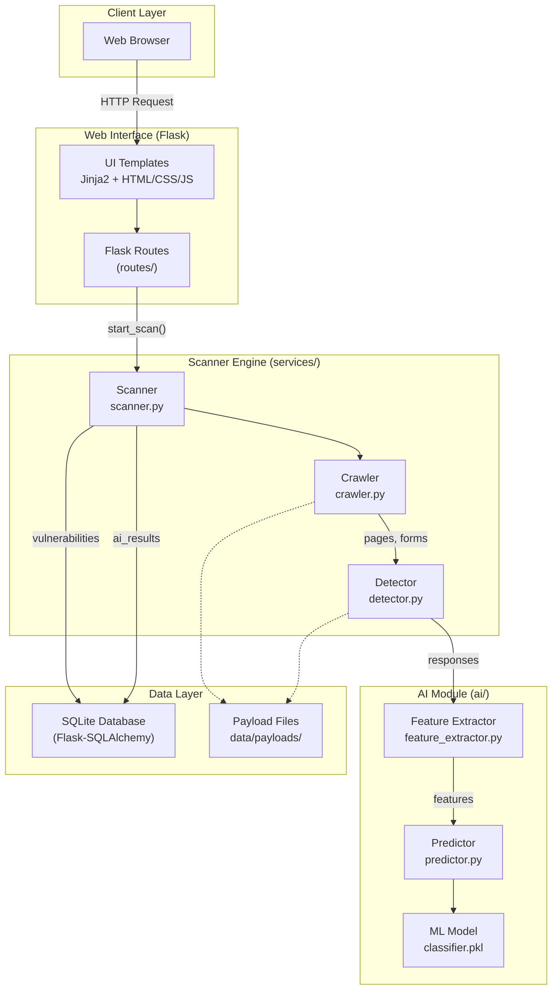
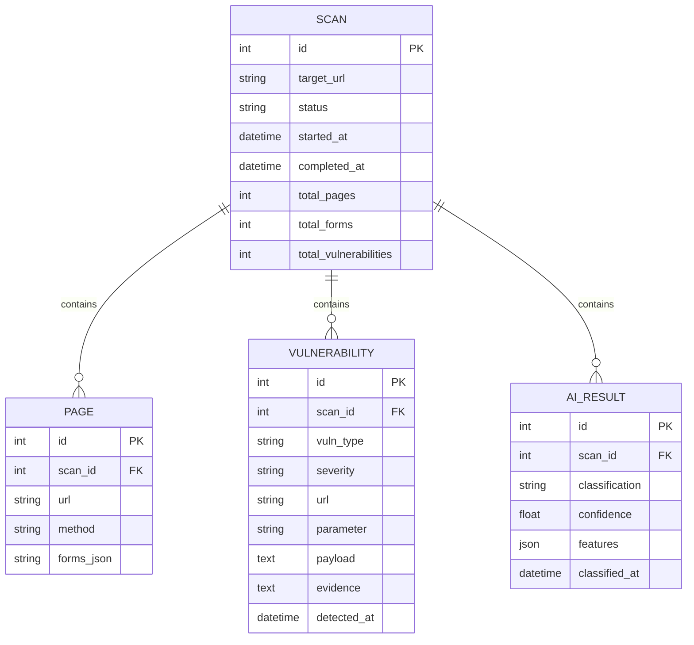
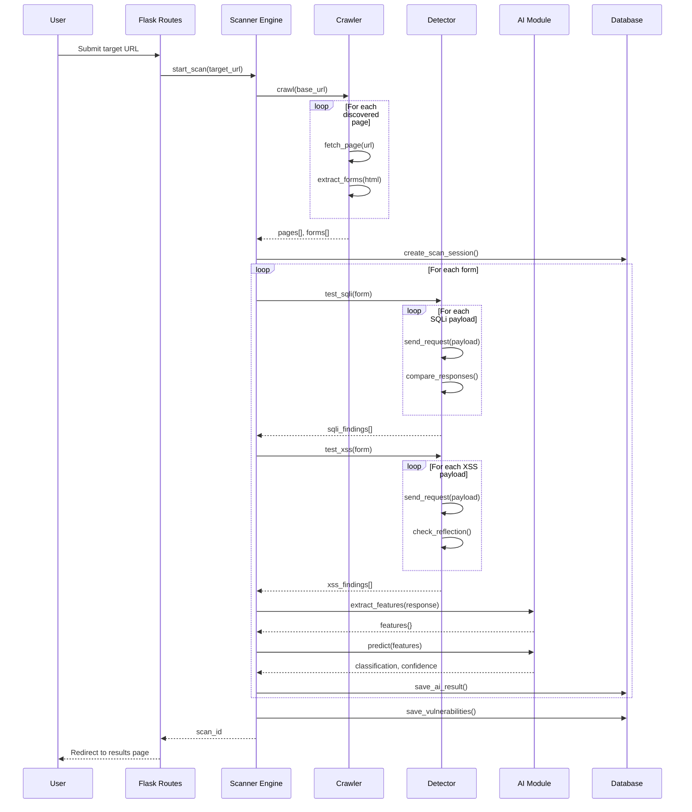
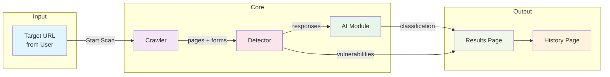

# System Architecture

> **Phase:** Phase 2 - System Architecture Design
> **Day:** Day 13
> **Generated:** 2026-04-29

---

## 1. High-Level System Architecture

---

## 2. Module Descriptions

### 2.1 Web Interface Layer

| Module | File | Responsibility |
|--------|------|----------------|
| UI Templates | `templates/*.html` | Render pages using Jinja2: home, scan, results, history |
| Flask Routes | `app/routes/*.py` | Handle HTTP requests, call scanner engine, return responses |

**Routes:**

| Route | File | Description |
|-------|------|-------------|
| `/` | `main.py` | Home page - URL input form |
| `/scan` | `scan.py` | Start a new scan session |
| `/results/<id>` | `results.py` | Display scan results |
| `/history` | `history.py` | List past scan sessions |

### 2.2 Scanner Engine

| Module | File | Responsibility |
|--------|------|----------------|
| Scanner | `scanner.py` | Orchestrates the full pipeline: crawl → detect → AI → save |
| Crawler | `crawler.py` | Discover pages and forms from target URL |
| Detector | `detector.py` | Inject payloads and analyze responses for SQLi/XSS |

**Crawler (`crawler.py`) responsibilities:**
- BFS traversal from base URL
- Respect max depth (default: 3) and max pages (default: 50)
- Extract all `<a>` links and `<form>` elements
- Skip external domains, logout links, duplicate URLs
- Return list of `Page` objects with forms

**Detector (`detector.py`) responsibilities:**
- Send baseline request (normal parameters)
- Inject payloads from `data/payloads/sqli_payloads.txt` and `data/payloads/xss_payloads.txt`
- Compare test response vs baseline (length, status code, content)
- Detect SQL error keywords and XSS reflection patterns
- Return list of `Vulnerability` objects

### 2.3 AI Module

| Module | File | Responsibility |
|--------|------|----------------|
| Feature Extractor | `ai/feature_extractor.py` | Extract numeric features from HTTP responses |
| Predictor | `ai/predictor.py` | Load model and predict classification |
| Trainer | `ai/trainer.py` | Train and save the ML model |

**Feature set:**

| Feature | Type | Description |
|---------|------|-------------|
| `response_length` | Numeric | Length of HTTP response body |
| `status_code` | Numeric | HTTP status code (200, 500, etc.) |
| `keyword_presence` | Boolean | SQL error keywords found in response |
| `payload_reflection` | Boolean | XSS payload reflected in response |

**Model:** LogisticRegression (primary), RandomForest (comparison). Both trained via scikit-learn.

### 2.4 Data Layer

| Component | Description |
|-----------|-------------|
| SQLite Database | Persistent storage via Flask-SQLAlchemy |
| Models | `Scan`, `Page`, `Vulnerability`, `AIResult` |
| Payload Files | Plain-text files with detection payloads |

**Database Schema (ER Overview):**

---

## 3. Data Flow

---

## 4. Component Interaction Summary

| Interaction | Description |
|-------------|-------------|
| URL → Crawler | User submits URL; crawler starts BFS from it |
| Crawler → Detector | Crawler passes discovered forms to detector for testing |
| Detector → AI | Detector sends responses to AI for classification |
| Detector → Results | Vulnerabilities saved and displayed |
| AI → Results | AI classifications saved and displayed |

---

## 5. File-to-Module Mapping

| File Path | Role |
|-----------|------|
| `app/routes/main.py` | Home page route |
| `app/routes/scan.py` | Start scan route |
| `app/routes/results.py` | Display results route |
| `app/routes/history.py` | Display history route |
| `app/services/scanner.py` | Pipeline orchestrator |
| `app/services/crawler.py` | Page & form discovery |
| `app/services/detector.py` | SQLi & XSS testing |
| `app/services/ai_analyzer.py` | AI analysis integration |
| `ai/feature_extractor.py` | Feature extraction |
| `ai/predictor.py` | Model prediction |
| `ai/trainer.py` | Model training |
| `app/models/scan.py` | Scan session model |
| `app/models/page.py` | Page model |
| `app/models/vulnerability.py` | Vulnerability model |
| `app/models/ai_result.py` | AI result model |
| `data/payloads/sqli_payloads.txt` | SQLi payloads |
| `data/payloads/xss_payloads.txt` | XSS payloads |
| `templates/*.html` | UI templates |
| `app/static/css/style.css` | Styles |
| `app/static/js/main.js` | Frontend JS |
