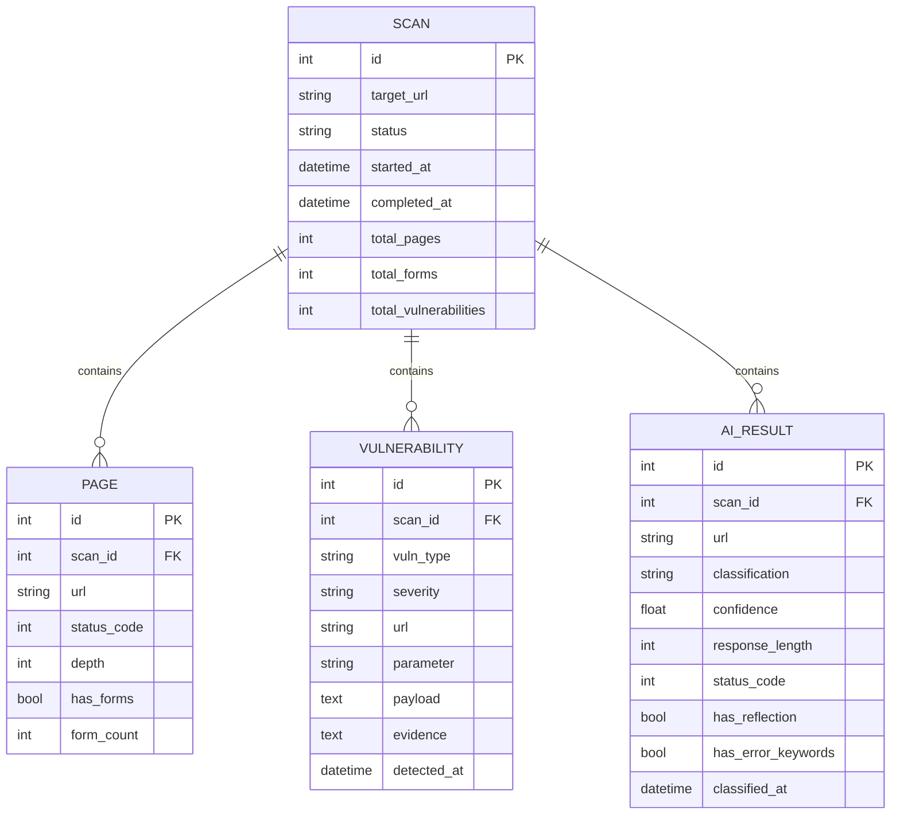

# ER Diagram - AI Web Vulnerability Scanner

> **Phase:** Phase 2 - System Design
> **Day:** Day 15
> **Database:** SQLite with Flask-SQLAlchemy

---

## ER Diagram



---

## Relationships

| Parent | Child | Type | Cascade |
|--------|-------|------|---------|
| SCAN | PAGE | One-to-Many | ON DELETE CASCADE |
| SCAN | VULNERABILITY | One-to-Many | ON DELETE CASCADE |
| SCAN | AI_RESULT | One-to-Many | ON DELETE CASCADE |

**ER Diagram (cu phap cuc bo):**

```
SCAN (1) ──┬── (N) PAGE
           ├── (N) VULNERABILITY
           └── (N) AI_RESULT
```

Moi SCAN chua nhieu PAGE, VULNERABILITY, AI_RESULT. Khi xoa SCAN, tat ca cac bang con deu bi xoa tu dong (cascade delete).
