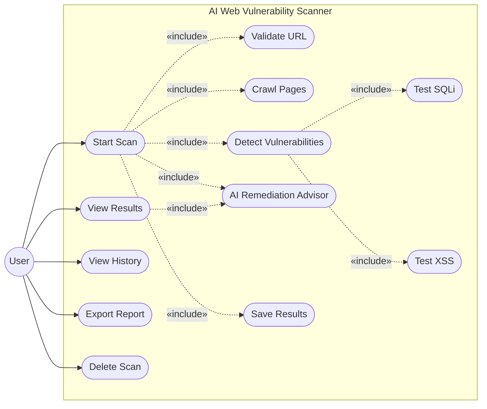
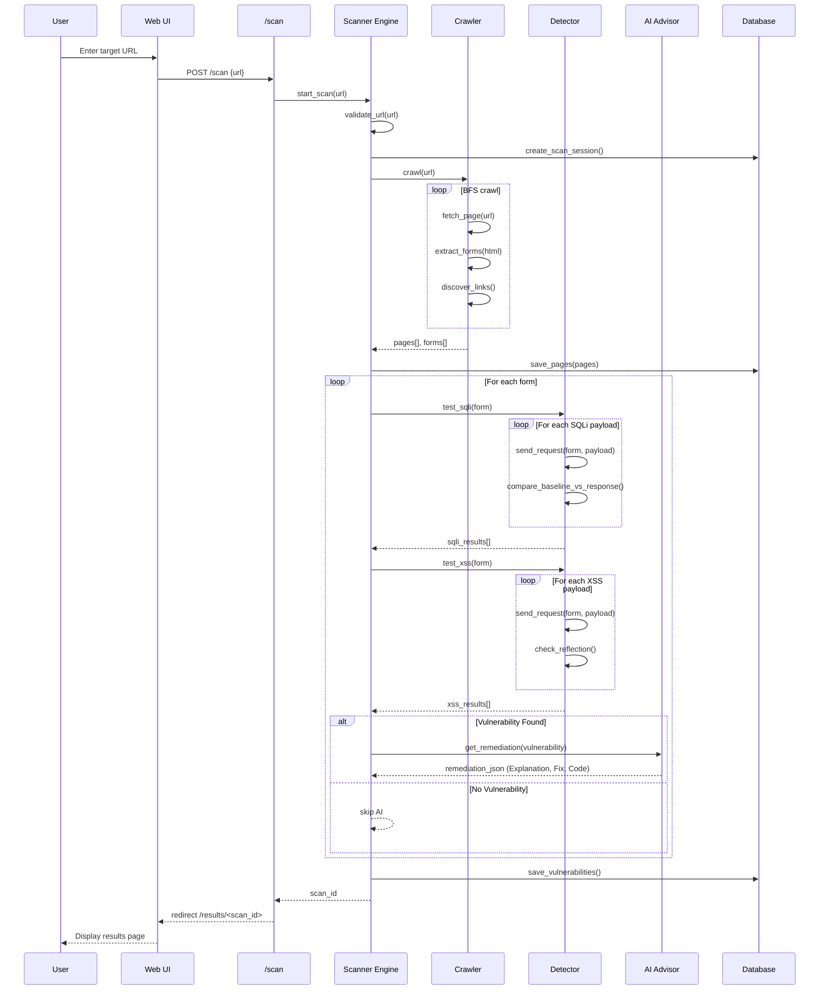
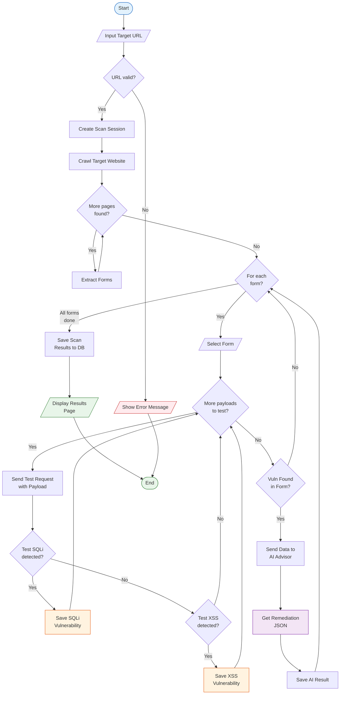

# UML Diagrams

> **Phase:** Phase 2 - System Architecture Design
> **Day:** Day 14
> **Generated:** 2026-04-30

---

## 1. Use Case Diagram

| Actor | Description |
|-------|-------------|
| User | Người dùng tương tác với hệ thống qua giao diện web |
| System | AI Web Vulnerability Scanner (Flask app) |
| AI Module | Mô-đun LLM tư vấn cách khắc phục lỗ hổng |

| Use Case | Description |
|----------|-------------|
| Start Scan | Nhập URL, bắt đầu quét toàn bộ pipeline |
| Validate URL | Kiểm tra URL hợp lệ và có thể truy cập |
| Crawl Pages | Thu thập pages và forms từ target |
| Detect Vulnerabilities | Thử nghiệm SQLi và XSS payloads |
| AI Remediation Advisor | Phân tích lỗ hổng và đưa ra hướng dẫn khắc phục |
| Save Results | Lưu kết quả vào database |
| View Results | Xem chi tiết kết quả sau khi scan xong |
| View History | Xem lịch sử các scan đã thực hiện |
| Export Report | Xuất báo cáo ra file |
| Delete Scan | Xóa một scan session khỏi lịch sử |

---

## 2. Sequence Diagram

**Ghi chu:** Nhanh `alt/else` cho AI Advisor logic - neu tim thay lo hong, he thong gui evidence cho LLM de lay huong dan khac phuc.

---

## 3. Activity Diagram (Scan Process)

**Tom tat flow:**
1. Nhap URL -> kiem tra hop le
2. Tao session -> crawl pages -> extract forms
3. Moi form: thu SQLi -> thu XSS -> Goi AI Advisor neu tim thay lo hong
4. Luu ket qua -> hien thi trang results
