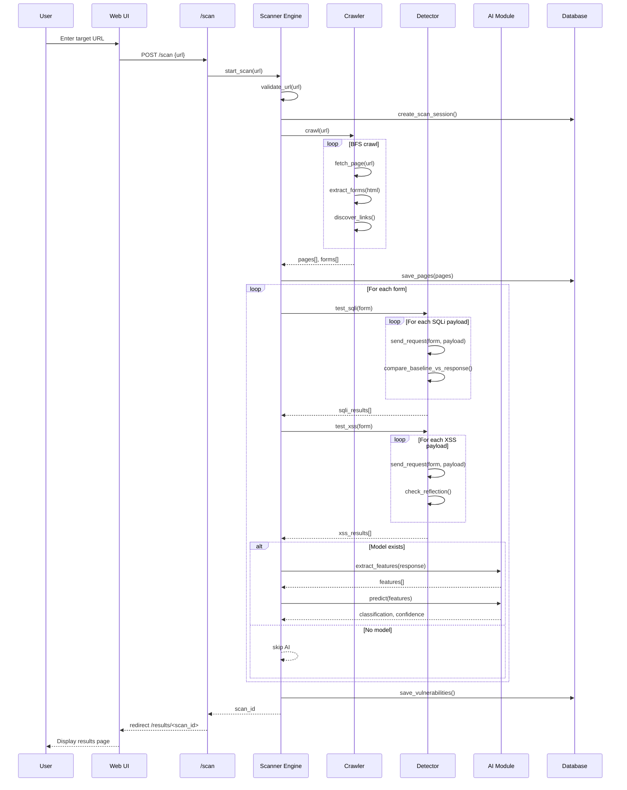
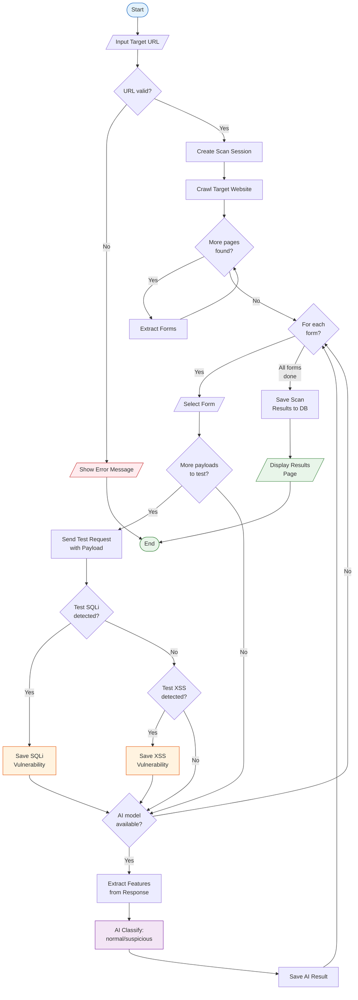

# UML Diagrams

> **Phase:** Phase 2 - System Architecture Design
> **Day:** Day 14
> **Generated:** 2026-04-30

---

## 1. Use Case Diagram

```mermaid
use case
  "User" as U
  "System" as S
  "AI Module" as AI

  U --> (Start Scan)
  U --> (View Results)
  U --> (View History)
  U --> (Export Report)
  U --> (Delete Scan)

  (Start Scan) ..> (Validate URL) : include
  (Start Scan) ..> (Crawl Pages) : include
  (Start Scan) ..> (Detect Vulnerabilities) : include
  (Start Scan) ..> (AI Classification) : include
  (Start Scan) ..> (Save Results) : include

  (Detect Vulnerabilities) ..> (Test SQLi) : include
  (Detect Vulnerabilities) ..> (Test XSS) : include

  (View Results) ..> (AI Classification) : include
```

| Actor | Description |
|-------|-------------|
| User | Người dùng tương tác với hệ thống qua giao diện web |
| System | AI Web Vulnerability Scanner (Flask app) |
| AI Module | Mô-đun phân loại phản hồi HTTP bằng ML |

| Use Case | Description |
|----------|-------------|
| Start Scan | Nhập URL, bắt đầu quét toàn bộ pipeline |
| Validate URL | Kiểm tra URL hợp lệ và có thể truy cập |
| Crawl Pages | Thu thập pages và forms từ target |
| Detect Vulnerabilities | Thử nghiệm SQLi và XSS payloads |
| AI Classification | Trích xuất features, phân loại phản hồi |
| Save Results | Lưu kết quả vào database |
| View Results | Xem chi tiết kết quả sau khi scan xong |
| View History | Xem lịch sử các scan đã thực hiện |
| Export Report | Xuất báo cáo ra file |
| Delete Scan | Xóa một scan session khỏi lịch sử |

---

## 2. Sequence Diagram



**Ghi chu:** Nhanh `alt/else` cho AI model fallback logic - neu chua co model trained, he thong van chay binh thuong chi khong co AI classification.

---

## 3. Activity Diagram (Scan Process)



**Tom tat flow:**
1. Nhap URL -> kiem tra hop le
2. Tao session -> crawl pages -> extract forms
3. Moi form: thu SQLi -> thu XSS -> AI classify (neu co model)
4. Luu ket qua -> hien thi trang results
