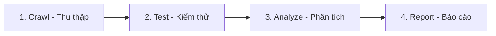
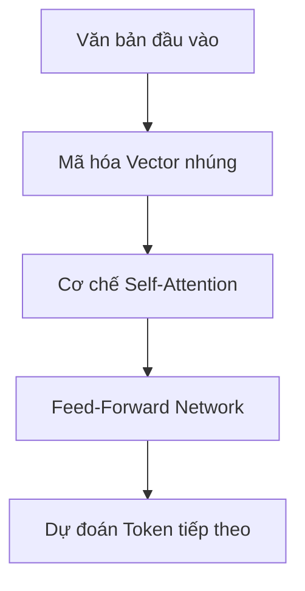

# CHƯƠNG 2: CƠ SỞ LÝ THUYẾT

Chương này trình bày hệ thống kiến thức nền tảng và cơ sở khoa học phục vụ cho việc nghiên cứu, thiết kế và triển khai hệ thống quét lỗ hổng ứng dụng web tích hợp trí tuệ nhân tạo. Nội dung trọng tâm bao gồm lý thuyết về kiến trúc ứng dụng web và giao thức truyền tải, phân tích chuyên sâu cơ chế và tác động của các lỗ hổng bảo mật phổ biến nhất theo phân loại OWASP, thuật toán crawling và thu thập thông tin cấu trúc ứng dụng, các phương pháp phát hiện lỗ hổng tự động dựa trên luật, và cuối cùng là lý thuyết về trí tuệ nhân tạo sinh cùng kỹ nghệ thiết kế câu lệnh (Prompt Engineering) trong lĩnh vực an toàn thông tin. Các nội dung này được sắp xếp theo trình tự logic phản ánh đúng dòng chảy xử lý của hệ thống: từ việc hiểu kiến trúc nền tảng của đối tượng kiểm thử, đến nhận diện các lớp lỗ hổng cần phát hiện, tiếp đó là các kỹ thuật thu thập và phân tích tự động, và cuối cùng là sự tham gia của trí tuệ nhân tạo trong việc diễn giải kết quả.

---

## 2.1. Kiến trúc ứng dụng web

### 2.1.1. Mô hình Client-Server

Mô hình Client-Server là kiến trúc phân tán nền tảng của mạng Internet nói chung và các ứng dụng web nói riêng [1]. Trong kiến trúc này, các tác vụ tính toán và xử lý dữ liệu được phân chia rõ ràng giữa hai thực thể: bên yêu cầu dịch vụ (Client) và bên cung cấp dịch vụ (Server). Trình duyệt web đóng vai trò là một client thông minh, đảm nhận nhiệm vụ biểu diễn giao diện người dùng, xử lý tương tác cục bộ và kết xuất nội dung đa phương tiện. Trong khi đó, máy chủ web (Server) tập trung vào việc xử lý các logic nghiệp vụ phức tạp, quản lý quyền truy cập, xác thực danh tính người dùng và vận hành các hệ quản trị cơ sở dữ liệu. Kiến trúc phân tầng này cho phép mỗi thành phần được phát triển, triển khai và nâng cấp một cách độc lập mà không gây ảnh hưởng đến thành phần còn lại, đây là nền tảng cho khả năng mở rộng theo chiều ngang (Horizontal Scalability) của các hệ thống web hiện đại.

Sự phân tách vai trò giữa client và server mang lại nhiều lợi thế kỹ thuật quan trọng. Về khía cạnh bảo mật, việc tập trung lưu trữ dữ liệu nhạy cảm và logic nghiệp vụ quan trọng tại môi trường máy chủ được kiểm soát chặt chẽ giúp thiết lập các cơ chế bảo vệ tập trung như tường lửa, hệ thống phát hiện xâm nhập và các chính sách kiểm soát truy cập. Về khía cạnh triển khai, client có thể hoạt động trên nhiều nền tảng khác nhau (trình duyệt desktop, trình duyệt di động, ứng dụng nhúng) miễn là tuân thủ các giao thức truyền thông chuẩn, tạo nên tính đa dạng cao cho tầng trình bày. Tuy nhiên, sự phân tách này cũng đồng thời định hình nên một ranh giới tin cậy (Trust Boundary) rõ ràng giữa hai thực thể: client hoạt động hoàn toàn trong môi trường không tin cậy do người dùng cuối có toàn quyền kiểm soát trình duyệt, bao gồm khả năng xem mã nguồn, can thiệp luồng dữ liệu và sửa đổi các yêu cầu truyền đi; trong khi server buộc phải chấp nhận và xử lý dữ liệu nhận được từ nguồn không kiểm soát này.

Quá trình tương tác chuẩn trong mô hình Client-Server tuân theo một chu trình yêu cầu-phản hồi (Request-Response Cycle) được thiết kế chặt chẽ. Chu trình khởi đầu khi người dùng thực hiện một hành động trên giao diện trình duyệt, chẳng hạn như nhập một đường dẫn vào thanh địa chỉ, nhấn vào một liên kết siêu văn bản, hoặc điền và gửi một biểu mẫu trực tuyến. Trình duyệt sau đó sẽ thu thập toàn bộ các tham số đầu vào liên quan, đóng gói chúng thành một thông điệp yêu cầu HTTP (HTTP Request) tuân thủ cấu trúc giao thức, và gửi thông điệp này qua hạ tầng mạng vật lý đến máy chủ đích. Tại phía server, máy chủ ứng dụng tiếp nhận yêu cầu, giải mã và phân tích cú pháp dữ liệu truyền vào (Parsing), áp dụng các bước kiểm tra hợp lệ, thực thi logic nghiệp vụ tương ứng — bao gồm cả việc truy vấn các hệ quản trị cơ sở dữ liệu khi cần thiết — và đóng gói toàn bộ kết quả xử lý thành một thông điệp phản hồi HTTP (HTTP Response) trả ngược về cho client. Cuối cùng, trình duyệt tiếp nhận phản hồi, phân tích cú pháp nội dung HTML và CSS, tải về các tài nguyên bổ sung như hình ảnh và tệp JavaScript, thực thi các kịch bản phía client để kết xuất (Render) trang web hoàn chỉnh và hiển thị cho người dùng.

Dưới góc nhìn an toàn thông tin, ranh giới truyền thông giữa client và server là nơi phát sinh phần lớn các nguy cơ bảo mật của ứng dụng web. Mọi dữ liệu bắt nguồn từ phía client — bao gồm tham số trên đường dẫn (URL Parameters), trường dữ liệu trong biểu mẫu (Form Fields), giá trị cookie, và thậm chí cả một số tiêu đề HTTP (HTTP Headers) — đều hoàn toàn có thể bị can thiệp và thao túng bởi kẻ tấn công trước khi đến được server. Các công cụ proxy trung gian (Interception Proxy) như Burp Suite hay OWASP ZAP cho phép chặn bắt, xem xét và sửa đổi mọi yêu cầu HTTP trước khi chúng rời khỏi trình duyệt, khiến cho toàn bộ các cơ chế kiểm tra hợp lệ phía client (Client-side Validation) như kiểm tra bằng JavaScript trở nên vô hiệu. Do đó, nguyên tắc phòng thủ cơ bản nhất và quan trọng nhất trong thiết kế ứng dụng web an toàn là không bao giờ tin tưởng dữ liệu đầu vào từ phía client (Never Trust Client Input) [2], mà phải luôn thực hiện kiểm tra hợp lệ và làm sạch dữ liệu (Sanitization) tại tầng máy chủ, bất kể dữ liệu đó đã qua kiểm tra ở phía client hay chưa.

### 2.1.2. Giao thức HTTP/HTTPS

HTTP (HyperText Transfer Protocol) là giao thức truyền tải siêu văn bản hoạt động ở tầng ứng dụng trong mô hình phân tầng TCP/IP, đóng vai trò định nghĩa cấu trúc, định dạng và ngữ nghĩa của các thông điệp trao đổi giữa client và server trên World Wide Web [3]. Giao thức này được thiết kế theo nguyên lý phi trạng thái (Stateless), nghĩa là mỗi yêu cầu HTTP được máy chủ xử lý một cách hoàn toàn độc lập mà không tự động lưu giữ bất kỳ thông tin ngữ cảnh hay trạng thái nào từ các yêu cầu đã xử lý trước đó. Tính chất stateless mang lại lợi thế đáng kể trong việc đơn giản hóa kiến trúc máy chủ, giảm tải bộ nhớ và tối ưu khả năng phục vụ đồng thời nhiều client, tuy nhiên đồng thời đặt ra yêu cầu về các cơ chế bổ sung để duy trì trạng thái phiên làm việc (Session State) của người dùng qua nhiều chu kỳ yêu cầu liên tiếp, chẳng hạn như Cookie, Session Token hoặc các cơ chế xác thực dựa trên mã thông báo (Token-based Authentication).

Giao thức HTTP định nghĩa một tập hợp các phương thức hoạt động (HTTP Methods) để chỉ thị loại hành động mà client mong muốn thực hiện đối với tài nguyên được xác định trên máy chủ. Phương thức `GET` là phương thức phổ biến nhất, được thiết kế để yêu cầu truy xuất biểu diễn của một tài nguyên từ máy chủ; các tham số đầu vào của phương thức này được đính trực tiếp vào chuỗi truy vấn trên đường dẫn (URL Query String) theo dạng `?key1=value1&key2=value2`, khiến dữ liệu dễ bị lộ trong lịch sử duyệt web của trình duyệt, nhật ký truy cập của máy chủ (Server Access Logs), hoặc các hệ thống proxy trung gian — điều này đặc biệt nguy hiểm khi dữ liệu chứa thông tin nhạy cảm như mật khẩu hay mã phiên. Ngược lại, phương thức `POST` được sử dụng để gửi dữ liệu lên máy chủ nhằm mục đích xử lý và tạo mới tài nguyên, với toàn bộ dữ liệu được đặt trong phần thân của yêu cầu (Request Body) thay vì trên đường dẫn, giúp bảo mật tốt hơn đối với các thông tin nhạy cảm, cho phép truyền tải dữ liệu dung lượng lớn và hỗ trợ nhiều định dạng mã hóa khác nhau như `application/x-www-form-urlencoded`, `multipart/form-data` hay `application/json`. Ngoài hai phương thức chính, HTTP còn định nghĩa các phương thức bổ sung: `PUT` để cập nhật toàn bộ nội dung của một tài nguyên hiện có, `PATCH` để cập nhật một phần tài nguyên, `DELETE` để yêu cầu xóa bỏ tài nguyên, `HEAD` hoạt động tương tự `GET` nhưng máy chủ chỉ trả về các tiêu đề phản hồi (Headers) mà không kèm theo phần thân (Body) — thường được sử dụng để kiểm tra nhanh sự tồn tại hoặc kích thước của tài nguyên mà không cần tải về toàn bộ nội dung, và `OPTIONS` để truy vấn danh sách các phương thức được hỗ trợ cho một tài nguyên cụ thể. Trong ngữ cảnh kiểm thử bảo mật ứng dụng web, hai phương thức `GET` và `POST` chiếm vai trò trung tâm vì chúng là cơ chế chính mà các biểu mẫu HTML sử dụng để truyền tải dữ liệu người dùng lên máy chủ, và do đó cũng là hai vector tấn công phổ biến nhất đối với các lỗ hổng dạng Injection.

Cấu trúc của một thông điệp HTTP yêu cầu (HTTP Request) tuân theo một định dạng văn bản chuẩn hóa gồm ba phần chính. Phần đầu tiên là dòng yêu cầu (Request Line) chứa ba thành phần: phương thức HTTP (GET, POST, v.v.), đường dẫn tài nguyên đích (URI — Uniform Resource Identifier) và phiên bản giao thức HTTP đang sử dụng (thường là HTTP/1.1 hoặc HTTP/2). Phần thứ hai là tập hợp các tiêu đề yêu cầu (Request Headers) — một chuỗi các cặp khóa-giá trị cung cấp siêu thông tin mô tả về yêu cầu, bao gồm tiêu đề `Host` xác định tên miền đích của máy chủ, `User-Agent` mô tả phần mềm trình duyệt đang sử dụng, `Accept` liệt kê các định dạng nội dung mà client chấp nhận xử lý, `Cookie` chứa dữ liệu phiên và thông tin xác thực đã được lưu trữ trước đó, `Content-Type` xác định kiểu mã hóa của dữ liệu trong phần thân, và nhiều tiêu đề khác. Phần thứ ba là thân yêu cầu (Request Body), chứa dữ liệu thực tế gửi kèm theo yêu cầu — phần này chủ yếu xuất hiện trong các yêu cầu POST hoặc PUT, còn đối với GET thì thường không có phần thân.

```http
Ví dụ một yêu cầu HTTP GET tiêu chuẩn gửi đến ứng dụng:
GET /vulnerabilities/sqli/?id=1&Submit=Submit HTTP/1.1
Host: localhost:8080
User-Agent: Mozilla/5.0 (Windows NT 10.0; Win64; x64)
Cookie: PHPSESSID=abc123xyz; security=low
Accept: text/html,application/xhtml+xml,application/xml;q=0.9
```

Tương tự, thông điệp phản hồi từ máy chủ (HTTP Response) cũng tuân theo cấu trúc ba phần gồm dòng trạng thái (Status Line), tiêu đề phản hồi (Response Headers) và thân phản hồi (Response Body). Dòng trạng thái bao gồm phiên bản giao thức HTTP và một mã trạng thái phản hồi (HTTP Status Code) — đây là chỉ số quan trọng nhất để client biết được kết quả xử lý yêu cầu của mình. Mã trạng thái HTTP được phân chia thành năm nhóm tiêu chuẩn theo chữ số hàng trăm. Nhóm `1xx` (Informational) mang tính chất thông tin tạm thời, chỉ thị rằng yêu cầu đã được máy chủ tiếp nhận và đang trong quá trình xử lý tiếp. Nhóm `2xx` (Success) biểu thị yêu cầu đã được tiếp nhận, hiểu đúng và thực thi thành công, trong đó mã `200 OK` là phổ biến nhất, xác nhận tài nguyên đã được trả về đầy đủ trong phần thân phản hồi; mã `201 Created` xác nhận một tài nguyên mới đã được tạo thành công trên máy chủ. Nhóm `3xx` (Redirection) chỉ ra rằng client cần thực hiện các hành động bổ sung — thường là gửi một yêu cầu mới đến địa chỉ URL khác — để hoàn tất yêu cầu ban đầu, ví dụ mã `301 Moved Permanently` cho biết tài nguyên đã được di chuyển vĩnh viễn sang địa chỉ mới, hoặc mã `302 Found` chỉ thị chuyển hướng tạm thời. Nhóm `4xx` (Client Error) phản ánh lỗi phía client khi yêu cầu chứa cú pháp sai hoặc không thể được máy chủ thực thi, bao gồm `400 Bad Request` cho yêu cầu có cấu trúc không hợp lệ, `401 Unauthorized` khi thiếu thông tin xác thực, `403 Forbidden` khi client không đủ quyền hạn truy cập, và `404 Not Found` khi tài nguyên yêu cầu không tồn tại trên máy chủ. Nhóm `5xx` (Server Error) phản ánh lỗi phía máy chủ khi server gặp sự cố nội bộ hoặc không thể thực thi một yêu cầu hợp lệ, trong đó `500 Internal Server Error` là mã lỗi tổng quát nhất, thường xuất hiện khi logic ứng dụng gặp biệt lệ (Exception) không được xử lý; mã `503 Service Unavailable` cho biết máy chủ tạm thời không thể phục vụ do quá tải hoặc đang bảo trì. Trong ngữ cảnh kiểm thử bảo mật, sự thay đổi mã trạng thái giữa yêu cầu bình thường và yêu cầu chứa payload tấn công là một chỉ dấu quan trọng, ví dụ khi mã trạng thái chuyển từ `200 OK` sang `500 Internal Server Error` sau khi gửi một payload SQL Injection, đây là bằng chứng cho thấy payload đã tác động trực tiếp đến logic xử lý phía server và gây ra biệt lệ trong quá trình biên dịch câu truy vấn SQL.

HTTPS (HTTP Secure) là phiên bản bảo mật mở rộng của giao thức HTTP, tích hợp thêm lớp mã hóa TLS (Transport Layer Security) — phiên bản kế nhiệm của SSL (Secure Sockets Layer) — vào giữa tầng ứng dụng và tầng truyền tải trong mô hình TCP/IP [4]. Giao thức HTTPS giải quyết đồng thời ba bài toán bảo mật cốt lõi trên kênh truyền dẫn mạng. Bài toán tính bí mật (Confidentiality) được giải quyết thông qua mã hóa đối xứng (Symmetric Encryption) toàn bộ dữ liệu trao đổi, ngăn chặn việc kẻ tấn công nghe lén (Eavesdropping) nội dung truyền tải trên đường truyền. Bài toán tính toàn vẹn (Integrity) được đảm bảo bằng các mã xác thực thông điệp (Message Authentication Code — MAC), phát hiện và ngăn chặn mọi nỗ lực sửa đổi dữ liệu trên đường truyền bởi các cuộc tấn công Man-in-the-Middle. Bài toán tính xác thực (Authentication) được giải quyết thông qua hệ thống chứng chỉ số X.509 do các tổ chức chứng thực (Certificate Authority — CA) uy tín cấp phát, cho phép trình duyệt xác minh danh tính thực sự của máy chủ trước khi thiết lập kết nối. Cần đặc biệt nhấn mạnh rằng HTTPS chỉ bảo vệ dữ liệu trong quá trình di chuyển trên mạng vật lý (Data in Transit); khi dữ liệu đến máy chủ và được giải mã tại tầng TLS, nó sẽ được chuyển giao nguyên vẹn cho tầng ứng dụng để xử lý. Tại đây, các lỗ hổng logic ở tầng ứng dụng như SQL Injection hay Cross-Site Scripting vẫn hoàn toàn có thể bị khai thác, vì chúng xảy ra sau khi dữ liệu đã được giải mã và nằm trong phạm vi xử lý của mã nguồn ứng dụng. Do đó, việc sử dụng HTTPS tuyệt đối không thay thế được nhu cầu lập trình an toàn và kiểm tra hợp lệ đầu vào ở tầng ứng dụng.

### 2.1.3. Cơ chế giao tiếp và duy trì trạng thái

Quy trình thiết lập truyền thông giữa trình duyệt và máy chủ web diễn ra qua một chuỗi các giai đoạn kỹ thuật chặt chẽ, mỗi giai đoạn đảm nhận một chức năng cụ thể trong việc thiết lập kênh truyền dẫn tin cậy. Giai đoạn đầu tiên là phân giải tên miền (DNS Resolution), trong đó hệ thống phân giải tên miền (Domain Name System) chuyển đổi địa chỉ URL dạng ký tự mà con người dễ nhớ (ví dụ `www.example.com`) thành địa chỉ IP vật lý tương ứng (ví dụ `93.184.216.34`) mà các thiết bị mạng có thể định tuyến. Trình duyệt sẽ lần lượt kiểm tra bộ nhớ đệm DNS cục bộ, bộ nhớ đệm của hệ điều hành, và cuối cùng truy vấn đến các máy chủ DNS đệ quy để thu được địa chỉ IP. Tiếp theo, trình duyệt thiết lập kết nối TCP (Transmission Control Protocol) đến cổng dịch vụ tương ứng trên máy chủ — cổng 80 đối với HTTP hoặc cổng 443 đối với HTTPS — thông qua quá trình bắt tay ba bước (Three-way Handshake) gồm các gói tin SYN, SYN-ACK và ACK để đồng bộ trạng thái kết nối giữa hai đầu. Nếu sử dụng kết nối HTTPS, một quá trình bắt tay TLS (TLS Handshake) sẽ được kích hoạt ngay sau khi kết nối TCP được thiết lập, trong đó trình duyệt và máy chủ sẽ thỏa thuận phiên bản TLS và bộ thuật toán mật mã (Cipher Suite) sẽ sử dụng, máy chủ trình diện chứng chỉ số TLS/SSL để trình duyệt xác thực, hai bên trao đổi khóa phiên (Session Key) thông qua cơ chế mật mã khóa công khai (Public-key Cryptography), và cuối cùng thiết lập kênh truyền mã hóa đối xứng an toàn trước khi bất kỳ dữ liệu ứng dụng nào được gửi đi. Khi kênh truyền đã sẵn sàng, trình duyệt gửi HTTP Request và chờ nhận HTTP Response từ server, sau đó phân tích nội dung HTML nhận được, tải thêm các tài nguyên phụ thuộc (CSS, JavaScript, hình ảnh, phông chữ) thông qua các yêu cầu bổ sung, và kết xuất trang web hoàn chỉnh cho người dùng.

Để giải quyết tính chất phi trạng thái của HTTP và cho phép máy chủ nhận diện các yêu cầu liên tiếp đến từ cùng một người dùng, cơ chế Cookie và Session đóng vai trò then chốt trong quản lý phiên làm việc. Cookie là một đoạn dữ liệu nhỏ có kích thước tối đa khoảng 4KB do máy chủ tạo ra và gửi về trình duyệt thông qua tiêu đề `Set-Cookie` trong phản hồi HTTP; trình duyệt có trách nhiệm lưu trữ cookie này trên đĩa cứng hoặc bộ nhớ tạm (tùy thuộc vào thuộc tính thời hạn sống của cookie) và tự động đính kèm nó vào tiêu đề `Cookie` của mọi yêu cầu tiếp theo gửi đến cùng tên miền đích. Cookie có thể chứa nhiều loại thông tin khác nhau từ tùy chọn ngôn ngữ hiển thị, trạng thái giỏ hàng thương mại điện tử, đến — và đặc biệt quan trọng — định danh phiên làm việc (Session ID) dùng để liên kết trình duyệt với một phiên cụ thể trên máy chủ. Session là cấu trúc dữ liệu phía server lưu trữ trực tiếp trên bộ nhớ hoặc hệ thống lưu trữ của máy chủ, chứa toàn bộ thông tin trạng thái phiên làm việc của người dùng như danh tính sau đăng nhập, quyền hạn truy cập và các dữ liệu tạm thời khác. Mỗi phiên được gắn với một Session ID duy nhất — thường là một chuỗi ký tự ngẫu nhiên có độ dài đủ lớn để chống đoán — và Session ID này được gửi cho client dưới dạng cookie. Mỗi khi client gửi yêu cầu mới, máy chủ đọc Session ID từ tiêu đề Cookie, tra cứu trong bộ nhớ phiên để khôi phục trạng thái tương ứng và tiếp tục xử lý trong ngữ cảnh đã xác thực. Đối với một hệ thống quét lỗ hổng tự động, việc hiểu và mô phỏng chính xác cơ chế Cookie-Session này là điều kiện tiên quyết bắt buộc, vì phần lớn các trang chức năng quan trọng của ứng dụng web (như trang quản trị, trang xem thông tin cá nhân, trang chỉnh sửa dữ liệu) đều nằm sau lớp xác thực và chỉ có thể truy cập khi kèm theo cookie phiên hợp lệ.

Biểu mẫu HTML (HTML Form) đại diện cho cơ chế tương tác động chính và phổ biến nhất giữa người dùng và ứng dụng web, đồng thời cũng là vector tấn công (Attack Vector) quan trọng nhất trong kiểm thử bảo mật. Một biểu mẫu được định nghĩa bằng phần tử `<form>` trong mã nguồn HTML, bao gồm thuộc tính `action` xác định đường dẫn URL đích sẽ tiếp nhận và xử lý dữ liệu biểu mẫu, và thuộc tính `method` xác định phương thức HTTP (GET hoặc POST) được sử dụng để truyền tải dữ liệu. Bên trong phần tử `<form>`, các thẻ nhập liệu như `<input>` (hỗ trợ nhiều kiểu dữ liệu: text, password, hidden, checkbox, radio, file), `<textarea>` (vùng nhập văn bản nhiều dòng) và `<select>` (danh sách tùy chọn thả xuống) tạo nên các trường thu thập dữ liệu người dùng. Mỗi trường nhập liệu được gắn một thuộc tính `name` duy nhất đóng vai trò là tên khóa (Key), và giá trị mà người dùng nhập vào hoặc chọn trở thành giá trị tương ứng (Value). Khi hành động gửi biểu mẫu (Submit) được kích hoạt, trình duyệt tự động thu thập tất cả các cặp `name=value` từ các trường nhập liệu, mã hóa chúng theo định dạng phù hợp (URL Encoding cho GET, hoặc Form Encoding cho POST) và truyền tải lên máy chủ. Đặc biệt đáng chú ý, các trường nhập ẩn (Hidden Fields) với thuộc tính `type="hidden"` không hiển thị trên giao diện nhưng vẫn được gửi kèm yêu cầu, thường được sử dụng để chứa các thông tin trạng thái nội bộ hoặc mã thông báo bảo mật CSRF (Cross-Site Request Forgery Token). Mỗi trường nhập liệu trong biểu mẫu đại diện cho một điểm tiêm dữ liệu tiềm năng (Potential Injection Point) mà kẻ tấn công có thể lợi dụng nếu máy chủ không xử lý dữ liệu đầu vào một cách an toàn, do đó việc phát hiện và kiểm thử toàn diện tất cả các biểu mẫu là nhiệm vụ trọng tâm của bất kỳ hệ thống quét lỗ hổng web nào.

Tóm lại, sự tương tác động giữa trình duyệt và máy chủ thông qua giao thức HTTP/HTTPS, kết hợp với các cơ chế duy trì trạng thái phiên và biểu mẫu nhập liệu, cấu thành nên cơ chế vận hành cốt lõi của ứng dụng web. Tuy nhiên, tính chất phi trạng thái của giao thức cùng sự phụ thuộc vào dữ liệu đầu vào không tin cậy từ phía client tạo ra vô số các điểm tiếp nhận dữ liệu nhạy cảm. Nếu không được kiểm soát và làm sạch nghiêm ngặt tại server, đây chính là nguồn gốc phát sinh các lỗ hổng bảo mật nghiêm trọng ở tầng ứng dụng, được phân tích chi tiết trong Phần 2.2.

---

## 2.2. Các lỗ hổng bảo mật web

### 2.2.1. SQL Injection (SQLi)

#### Định nghĩa và nguyên nhân

SQL Injection là lỗ hổng bảo mật nghiêm trọng tầng ứng dụng xảy ra khi chương trình chèn trực tiếp dữ liệu đầu vào từ người dùng vào câu truy vấn SQL trước khi gửi đến hệ quản trị cơ sở dữ liệu (Database Management System — DBMS) mà không áp dụng các biện pháp kiểm soát cú pháp hoặc tham số hóa đầy đủ [5]. Lỗ hổng này cho phép kẻ tấn công phá vỡ cấu trúc ngữ nghĩa ban đầu mà lập trình viên đã thiết kế cho câu truy vấn, từ đó chèn thêm các đoạn mã SQL độc hại tùy ý vào lệnh thực thi. Hậu quả của SQL Injection có thể bao gồm việc truy xuất trái phép toàn bộ dữ liệu nhạy cảm trong cơ sở dữ liệu (thông tin cá nhân, thông tin tài chính, băm mật khẩu), sửa đổi hoặc xóa dữ liệu quan trọng, vượt qua các cơ chế xác thực và phân quyền, và trong các trường hợp nghiêm trọng nhất còn có thể leo thang đặc quyền để chiếm quyền điều khiển toàn bộ hệ thống máy chủ cơ sở dữ liệu hoặc thậm chí máy chủ ứng dụng thông qua các tính năng mở rộng của DBMS. Theo tài liệu phân loại điểm yếu chung CWE-89 do tổ chức MITRE quản lý, SQL Injection liên tục nằm trong danh sách các lỗ hổng nguy hiểm nhất và phổ biến nhất đối với ứng dụng web qua nhiều thập kỷ [6]. Báo cáo OWASP Top 10 — danh sách mười loại rủi ro bảo mật ứng dụng web nghiêm trọng nhất do cộng đồng an toàn thông tin thế giới bình chọn — cũng liên tục xếp Injection vào nhóm các mối đe dọa hàng đầu trong nhiều phiên bản liên tiếp.

Nguyên nhân gốc rễ của SQL Injection bắt nguồn từ một sai lầm thiết kế cơ bản: sự trộn lẫn giữa **Dữ liệu (Data)** và **Mã lệnh (Instruction)** trong cùng một kênh truyền thông. Khi lập trình viên xây dựng câu lệnh SQL bằng kỹ thuật nối chuỗi (String Concatenation) trực tiếp với các biến dữ liệu lấy từ người dùng — ví dụ thông qua phép nối chuỗi như `"SELECT * FROM users WHERE id = '" + user_input + "'"` — ranh giới ngữ pháp giữa phần cấu trúc cú pháp của câu lệnh SQL (phần mã lệnh mà DBMS cần biên dịch) và phần giá trị đầu vào (phần dữ liệu thuần túy cần được so sánh hoặc chèn) bị xóa bỏ hoàn toàn. Trong mô hình nối chuỗi này, DBMS không có cách nào phân biệt đâu là cú pháp SQL do lập trình viên thiết kế và đâu là dữ liệu do người dùng cung cấp — toàn bộ chuỗi kết quả được coi như một câu lệnh SQL duy nhất và được biên dịch, thực thi nguyên khối. Kẻ tấn công lợi dụng điều này bằng cách chèn các ký tự điều khiển đặc biệt của ngôn ngữ SQL vào dữ liệu đầu vào — chẳng hạn dấu nháy đơn `'` để đóng sớm một chuỗi ký tự literal, toán tử logic `OR` để thay đổi điều kiện lọc, ký tự chú thích `--` hoặc `#` để vô hiệu hóa phần còn lại của câu truy vấn gốc, hay dấu chấm phẩy `;` để kết thúc một lệnh và bắt đầu một lệnh mới hoàn toàn.

Bên cạnh nguyên nhân kỹ thuật chính từ việc nối chuỗi, sự vắng mặt của các biện pháp phòng thủ bổ sung cũng góp phần tạo điều kiện cho SQL Injection tồn tại và bị khai thác thành công. Việc thiếu kiểm tra hợp lệ đầu vào (Input Validation) khiến máy chủ chấp nhận mọi loại dữ liệu với độ dài và ký tự tùy ý, bao gồm cả các ký tự đặc biệt có ý nghĩa cú pháp trong SQL. Việc không áp dụng nguyên tắc đặc quyền tối thiểu (Least Privilege) cho tài khoản cơ sở dữ liệu của ứng dụng khiến tác động của một cuộc tấn công thành công trở nên nghiêm trọng hơn rất nhiều, khi kẻ tấn công có thể thực thi không chỉ các câu truy vấn đọc mà còn cả các lệnh ghi, xóa, hoặc thậm chí các thủ tục lưu trữ (Stored Procedures) nguy hiểm. Việc để lộ thông báo lỗi chi tiết của DBMS (Verbose Error Messages) trên phản hồi HTTP cung cấp cho kẻ tấn công thông tin quý giá về cấu trúc nội bộ của cơ sở dữ liệu, giúp họ tinh chỉnh payload một cách chính xác hơn.

Để minh họa cụ thể cơ chế can thiệp ngữ nghĩa của SQL Injection, xét một đoạn mã xử lý xác thực không an toàn trong ứng dụng web:
```sql
-- Truy vấn gốc được thiết kế bởi lập trình viên:
SELECT * FROM users WHERE username = 'input_user' AND password = 'input_password';
```
Với đầu vào bình thường như `username = 'admin'` và `password = 'secret123'`, câu truy vấn được tạo ra là `SELECT * FROM users WHERE username = 'admin' AND password = 'secret123'`, hoạt động đúng theo thiết kế và chỉ trả về bản ghi nếu cả hai điều kiện đều thỏa mãn. Tuy nhiên, nếu kẻ tấn công nhập vào tham số `username` giá trị độc hại `' OR '1'='1` và giá trị `password` tùy ý, câu truy vấn thực tế mà DBMS nhận được và biên dịch sẽ trở thành:
```sql
SELECT * FROM users WHERE username = '' OR '1'='1' AND password = 'any';
```
Do biểu thức `'1'='1'` luôn trả về giá trị logic đúng (True) và toán tử `OR` khiến mệnh đề điều kiện trả về True bất kể giá trị của `username`, toàn bộ logic xác thực bị vô hiệu hóa và DBMS trả về bản ghi đầu tiên trong bảng users — thường chính là tài khoản quản trị hệ thống (Administrator). Đây mới chỉ là ví dụ đơn giản nhất; trong thực tế, kẻ tấn công có thể xây dựng các payload phức tạp hơn nhiều để trích xuất toàn bộ cấu trúc cơ sở dữ liệu, đọc dữ liệu từ bất kỳ bảng nào, ghi tệp lên hệ thống tệp tin của máy chủ, hoặc thực thi các lệnh hệ điều hành thông qua các tính năng mở rộng đặc quyền của DBMS.

#### Phân loại SQL Injection

Dựa trên kỹ thuật khai thác và kênh truyền thông (Communication Channel) mà kẻ tấn công sử dụng để trích xuất dữ liệu từ hệ thống đích, SQL Injection được phân chia thành ba nhóm chính.

Nhóm thứ nhất là In-band SQL Injection (hay SQLi nội băng), dạng tấn công trực tiếp và phổ biến nhất trong thực tế. Trong dạng này, kẻ tấn công sử dụng cùng một kênh giao tiếp HTTP để vừa gửi payload tấn công vừa nhận kết quả trích xuất dữ liệu ngay trong nội dung phản hồi trả về. In-band SQLi bao gồm hai kỹ thuật phụ quan trọng. Kỹ thuật Error-based SQLi khai thác hiện tượng nhiều ứng dụng web — đặc biệt trong các môi trường phát triển hoặc cấu hình không an toàn — trả về thông báo lỗi chi tiết của DBMS khi gặp truy vấn có lỗi cú pháp; kẻ tấn công cố tình gây ra các lỗi SQL được tính toán trước để buộc DBMS tiết lộ các thông tin nhạy cảm về cấu trúc nội bộ bao gồm tên cơ sở dữ liệu, phiên bản DBMS, tên bảng, tên cột, hoặc thậm chí trực tiếp hiển thị dữ liệu cần trích xuất thông qua các hàm lỗi đặc thù của từng DBMS. Kỹ thuật Union-based SQLi sử dụng toán tử `UNION` của SQL để kết hợp tập kết quả (Result Set) của câu truy vấn gốc với tập kết quả của một câu truy vấn hoàn toàn mới do kẻ tấn công xây dựng; điều kiện tiên quyết là hai truy vấn phải có cùng số lượng cột và kiểu dữ liệu tương thích, và khi thành công, kẻ tấn công có thể trích xuất dữ liệu từ bất kỳ bảng nào trong cơ sở dữ liệu và hiển thị chúng trực tiếp trên giao diện phản hồi của ứng dụng, ví dụ payload `' UNION SELECT username, password FROM admin_users--` cho phép đọc thông tin đăng nhập quản trị.

Nhóm thứ hai là Blind SQL Injection (hay SQLi mù), xuất hiện khi ứng dụng đã triển khai các biện pháp che giấu lỗi — tắt thông báo lỗi chi tiết, không hiển thị trực tiếp kết quả truy vấn trên giao diện — khiến kẻ tấn công không thể đọc trực tiếp dữ liệu trích xuất mà phải suy luận gián tiếp thông qua sự khác biệt tinh tế trong hành vi phản hồi của ứng dụng. Boolean-based Blind SQLi hoạt động bằng cách chèn các biểu thức điều kiện logic Đúng/Sai vào câu truy vấn và quan sát xem nội dung trang phản hồi có thay đổi tương ứng hay không; nếu trang hiển thị khác nhau giữa hai trạng thái (ví dụ hiển thị "Tìm thấy kết quả" khi điều kiện đúng và "Không tìm thấy" khi điều kiện sai), kẻ tấn công có thể đặt các câu hỏi nhị phân về dữ liệu cần trích xuất (chẳng hạn "Ký tự đầu tiên của tên bảng có phải là 'u' không?") và từng bước một xây dựng lại toàn bộ thông tin mong muốn, mặc dù quá trình này đòi hỏi số lượng yêu cầu rất lớn. Time-based Blind SQLi là biến thể tinh vi hơn, sử dụng trong trường hợp ngay cả nội dung phản hồi cũng không có sự khác biệt đáng kể giữa điều kiện đúng và sai; kẻ tấn công sử dụng các hàm gây trễ thời gian xử lý tích hợp sẵn trong DBMS — như `SLEEP(5)` trong MySQL, `pg_sleep(5)` trong PostgreSQL hay `WAITFOR DELAY '0:0:5'` trong Microsoft SQL Server — kết hợp với các biểu thức điều kiện, và xác định tính đúng sai dựa trên việc phản hồi HTTP có bị trễ thêm đúng khoảng thời gian đã chỉ định hay không.

Nhóm thứ ba là Out-of-band SQL Injection (hay SQLi ngoại băng), dạng tấn công phức tạp và ít phổ biến nhất. Trong dạng này, kẻ tấn công sử dụng một kênh truyền thông hoàn toàn khác biệt so với kết nối HTTP ban đầu để truyền dữ liệu ra ngoài. Kỹ thuật này kích hoạt DBMS thực hiện các thao tác kết nối mạng ngoại vi — chẳng hạn gửi yêu cầu phân giải DNS chứa dữ liệu đã mã hóa trong subdomain, hoặc thực hiện yêu cầu HTTP GET đến máy chủ do kẻ tấn công kiểm soát — và đính kèm dữ liệu cần trích xuất vào nội dung các yêu cầu đó. Out-of-band SQLi phụ thuộc vào nhiều điều kiện tiên quyết nghiêm ngặt: DBMS phải hỗ trợ các tính năng kết nối mạng ngoại vi, các tính năng mở rộng đặc quyền phải được kích hoạt, và cấu hình tường lửa mạng phải cho phép máy chủ cơ sở dữ liệu thiết lập các kết nối ra ngoài Internet — điều mà các môi trường production được cấu hình đúng cách thường hạn chế nghiêm ngặt.

#### Cơ chế khai thác

Quy trình khai thác SQL Injection tiêu chuẩn trải qua một chuỗi bốn giai đoạn kỹ thuật mang tính tuần tự. Giai đoạn đầu tiên là xác định điểm tiêm dữ liệu (Injection Point Identification), trong đó kẻ tấn công — hoặc công cụ quét tự động — tiến hành rà soát toàn bộ các tham số đầu vào trong các yêu cầu HTTP, bao gồm tham số URL (Query String Parameters), trường dữ liệu trong biểu mẫu POST, giá trị cookie, và thậm chí một số tiêu đề HTTP tùy chỉnh nếu ứng dụng sử dụng giá trị từ các tiêu đề này trong các câu truy vấn cơ sở dữ liệu. Giai đoạn thứ hai là thử nghiệm khả năng can thiệp ngữ nghĩa, trong đó kẻ tấn công gửi các ký tự kiểm thử cú pháp đặc trưng — tiêu biểu nhất là dấu nháy đơn `'`, dấu nháy kép `"`, dấu chấm phẩy `;` — và theo dõi phản hồi của ứng dụng để phát hiện các dấu hiệu bất thường như thông báo lỗi SQL, thay đổi nội dung trang, thay đổi mã trạng thái HTTP, hoặc biến động thời gian phản hồi. Khi một điểm tiêm được xác nhận tồn tại, giai đoạn thứ ba là xây dựng payload chuyên biệt và xác định chính xác loại DBMS đang vận hành cùng cấu trúc cú pháp tương ứng, bởi mỗi DBMS (MySQL, PostgreSQL, Oracle, Microsoft SQL Server, SQLite) có những đặc thù riêng về cú pháp chú thích, hàm xử lý chuỗi, hàm thời gian và các bảng hệ thống (System Tables) chứa siêu dữ liệu. Giai đoạn cuối cùng là trích xuất thông tin và khai thác sâu, kẻ tấn công xây dựng các chuỗi payload ngày càng phức tạp để lần lượt liệt kê tên các cơ sở dữ liệu, tên các bảng trong mỗi cơ sở dữ liệu, tên các cột trong mỗi bảng, và cuối cùng trích xuất toàn bộ dữ liệu nhạy cảm cần thiết; trong các kịch bản khai thác nâng cao, kẻ tấn công còn có thể ghi tệp lên hệ thống tệp tin của máy chủ (ví dụ thông qua `INTO OUTFILE` trong MySQL) hoặc thực thi lệnh hệ điều hành (ví dụ thông qua `xp_cmdshell` trong Microsoft SQL Server).

#### Phương pháp phòng chống

Giải pháp triệt để và hiệu quả nhất để ngăn chặn SQL Injection là sử dụng **Truy vấn tham số hóa (Parameterized Queries)** hay còn gọi là **Prepared Statements** [7]. Cơ chế này giải quyết vấn đề tại gốc rễ bằng cách phân tách hoàn toàn hai pha xử lý: pha biên dịch cấu trúc (Compilation Phase) và pha gắn kết dữ liệu (Data Binding Phase). Trong pha đầu tiên, câu lệnh SQL được gửi đến DBMS dưới dạng một khuôn mẫu (Template) chứa các ký tự đại diện (Placeholders — biểu diễn bằng dấu hỏi `?` hoặc tham số có tên `:param_name` tùy theo driver cơ sở dữ liệu); DBMS sẽ phân tích cú pháp, xác thực tính hợp lệ và biên dịch khuôn mẫu này thành một kế hoạch thực thi (Execution Plan) cố định. Trong pha thứ hai, dữ liệu người dùng được truyền riêng biệt và gắn kết trực tiếp vào các placeholder dưới dạng các giá trị thuần túy (Literals); DBMS sẽ không bao giờ phân tích lại hoặc diễn dịch các giá trị này dưới dạng cú pháp mã lệnh SQL, bất kể nội dung dữ liệu có chứa các ký tự đặc biệt hay các từ khóa SQL hay không. Nhờ cơ chế phân tách nghiêm ngặt này, nguy cơ can thiệp ngữ nghĩa bị loại bỏ hoàn toàn ở mức kiến trúc.

```python
# Ví dụ cài đặt an toàn sử dụng Parameterized Query trong Python (SQLite):
cursor.execute("SELECT * FROM users WHERE username = ? AND password = ?", (user_input, password_input))
```

Bên cạnh giải pháp cốt lõi Prepared Statements, việc thiết lập một chiến lược phòng thủ theo chiều sâu (Defense-in-Depth) đòi hỏi sự phối hợp của nhiều cơ chế hỗ trợ bổ sung để tạo ra nhiều lớp bảo vệ chồng lấp. Trước hết, kiểm định tính hợp lệ đầu vào (Input Validation) cần được áp dụng một cách có hệ thống: kiểm tra kiểu dữ liệu (đảm bảo tham số mong đợi kiểu số chỉ chấp nhận ký tự số), giới hạn độ dài tối đa (ngăn chặn các payload quá dài gây tràn bộ đệm hoặc chiếm tài nguyên xử lý), và ưu tiên sử dụng danh sách cho phép (Whitelist Validation) — chỉ chấp nhận các giá trị nằm trong một tập hợp hữu hạn được xác định trước — thay vì danh sách cấm (Blacklist Validation) vì danh sách cấm luôn tiềm ẩn nguy cơ bị vượt qua bởi các kỹ thuật mã hóa hoặc biến đổi ký tự tinh vi. Thêm vào đó, nguyên tắc đặc quyền tối thiểu (Least Privilege) yêu cầu tài khoản kết nối cơ sở dữ liệu của ứng dụng chỉ được cấp quyền hạn tối thiểu cần thiết cho hoạt động bình thường — nếu ứng dụng chỉ cần đọc dữ liệu thì tài khoản không nên có quyền INSERT, UPDATE hay DELETE, và tuyệt đối không được cấp quyền quản trị hệ thống như DBA hoặc SA — nhằm giới hạn phạm vi thiệt hại ngay cả trong trường hợp SQL Injection bị khai thác thành công. Cuối cùng, việc triển khai Tường lửa ứng dụng web (Web Application Firewall — WAF) ở tầng mạng cung cấp thêm một lớp phát hiện và ngăn chặn các mẫu ký tự độc hại đặc trưng của SQL Injection trước khi chúng tiếp cận được tầng ứng dụng, tuy nhiên WAF không nên được coi là biện pháp thay thế cho lập trình an toàn vì luôn tồn tại các kỹ thuật vượt tường lửa (WAF Bypass) thông qua mã hóa ký tự, biến đổi cú pháp hoặc kỹ thuật obfuscation tinh vi.

### 2.2.2. Cross-Site Scripting (XSS)

#### Định nghĩa và nguyên nhân

Cross-Site Scripting (XSS) là lỗ hổng bảo mật xảy ra khi ứng dụng web chèn trực tiếp dữ liệu không tin cậy từ phía người dùng vào nội dung mã nguồn HTML của trang web gửi về trình duyệt của khách hàng mà không thực hiện các biện pháp mã hóa đầu ra (Output Encoding) hoặc lọc dữ liệu (Sanitization) phù hợp [8]. Khác biệt căn bản so với SQL Injection — lỗ hổng tấn công vào phía server và cơ sở dữ liệu — XSS là một dạng tấn công hướng client (Client-side Attack), trong đó mục tiêu tối thượng của kẻ tấn công là chèn và thực thi các đoạn mã kịch bản độc hại (chủ yếu là JavaScript) ngay trong ngữ cảnh trình duyệt của người dùng nạn nhân. Mã JavaScript độc hại khi được thực thi trong trình duyệt nạn nhân sẽ hoạt động dưới tên miền hợp pháp của ứng dụng web, do đó hoàn toàn vượt qua các cơ chế phòng thủ dựa trên Chính sách đồng nguồn gốc (Same-Origin Policy — SOP) của trình duyệt — chính sách cốt lõi ngăn chặn các trang web từ tên miền khác truy cập vào dữ liệu và tài nguyên của tên miền hiện tại.

Phạm vi tác động của XSS rất rộng lớn và đa dạng tùy theo mức độ phức tạp của payload mà kẻ tấn công triển khai. Ở mức cơ bản nhất, kẻ tấn công có thể đánh cắp cookie phiên làm việc (Session Cookie) của nạn nhân thông qua câu lệnh `document.cookie` và gửi giá trị này đến máy chủ do kẻ tấn công kiểm soát, từ đó chiếm quyền kiểm soát tài khoản của nạn nhân mà không cần biết mật khẩu (Session Hijacking). Ở mức trung bình, kẻ tấn công có thể thao túng cây DOM (Document Object Model) của trang web để chèn một biểu mẫu đăng nhập giả mạo chồng lên giao diện thật, lừa nạn nhân nhập thông tin xác thực (Credential Phishing), hoặc chuyển hướng người dùng đến các trang web độc hại thông qua việc ghi đè `document.location`. Ở mức nâng cao, mã XSS có thể ghi nhận toàn bộ phím nhấn của nạn nhân (Keylogging) thông qua các bộ lắng nghe sự kiện (Event Listeners), thực hiện các yêu cầu HTTP giả mạo thay mặt nạn nhân để phát tán nội dung sai lệch hoặc thực hiện giao dịch tài chính trái phép, hoặc tải và thực thi các framework khai thác phức tạp (như BeEF — Browser Exploitation Framework) để chiếm quyền kiểm soát toàn diện trình duyệt của nạn nhân.

Nguyên nhân cốt lõi của lỗ hổng XSS nằm ở việc thiếu **Mã hóa đầu ra (Output Encoding)** — tức việc chuyển đổi các ký tự có ý nghĩa cú pháp đặc biệt trong HTML (như `<`, `>`, `"`, `'`, `&`) thành các thực thể HTML tương ứng an toàn (HTML Entities) trước khi chèn dữ liệu vào nội dung trang. Khi máy chủ nhận dữ liệu đầu vào từ người dùng và hiển thị ngược trở lại trình duyệt mà không thực hiện bước chuyển đổi này, trình duyệt sẽ hiểu nhầm các ký tự đặc biệt trong dữ liệu người dùng là các thẻ đánh dấu HTML hoặc khối mã kịch bản cần biên dịch và thực thi, tạo ra cơ hội cho kẻ tấn công chèn mã độc vào trang. Bên cạnh đó, một nguyên nhân bổ sung phổ biến là việc nhiều lập trình viên giả định rằng dữ liệu từ URL parameters, form fields hoặc cookies là an toàn và có thể hiển thị trực tiếp, trong khi thực tế mọi dữ liệu có nguồn gốc từ bên ngoài hệ thống đều cần được coi là không tin cậy.

#### Phân loại XSS

Dựa trên đường đi của dữ liệu độc hại và vị trí lưu trữ payload trong hệ thống, Cross-Site Scripting được phân chia thành ba dạng chính.

Reflected XSS (hay XSS phản xạ, còn gọi là Non-Persistent XSS) là dạng phổ biến nhất trong thực tế. Payload tấn công được nhúng trực tiếp trong yêu cầu HTTP — thường qua tham số truy vấn trên URL hoặc trường dữ liệu biểu mẫu — và được máy chủ phản xạ (reflect) ngược lại ngay trong nội dung phản hồi HTTP để hiển thị trên trình duyệt mà không qua bất kỳ cơ chế lưu trữ lâu dài nào trên server. Payload chỉ tồn tại trong đúng một chu kỳ request-response duy nhất, do đó kẻ tấn công cần chủ động dụ dỗ nạn nhân nhấn vào một liên kết đã được chế tạo sẵn chứa payload độc hại trong phần tham số URL, thường thông qua các chiến dịch email phishing, tin nhắn lừa đảo trên mạng xã hội hoặc các bình luận chứa liên kết trên các diễn đàn trực tuyến. Ví dụ điển hình: nếu ứng dụng có trang tìm kiếm hiển thị lại từ khóa tìm kiếm trên giao diện mà không mã hóa, URL dạng `http://example.com/search?q=<script>alert('XSS')</script>` sẽ khiến mã JavaScript được thực thi ngay trong trình duyệt nạn nhân khi họ truy cập liên kết.

Stored XSS (hay XSS lưu trữ, còn gọi là Persistent XSS) là dạng nguy hiểm hơn đáng kể so với Reflected XSS. Payload độc hại được gửi lên máy chủ và lưu trữ lâu dài trong các kho dữ liệu vĩnh trực — cơ sở dữ liệu, hệ thống tệp tin, hộp thư bình luận, tệp nhật ký — và mỗi khi bất kỳ người dùng nào truy cập vào trang chức năng có hiển thị dữ liệu đã bị nhiễm, trình duyệt của họ sẽ tự động tải về và thực thi mã độc mà không cần bất kỳ tương tác đặc biệt nào ngoài việc duyệt trang web hợp lệ. Stored XSS có sức tàn phá lớn hơn Reflected XSS ở ba khía cạnh: nó không yêu cầu nạn nhân nhấn vào liên kết đặc biệt, nó ảnh hưởng đồng thời đến tất cả người dùng truy cập trang bị nhiễm chứ không chỉ một cá nhân cụ thể, và nó khó phát hiện hơn vì payload nằm lẫn trong dữ liệu hợp lệ trên server. Một payload Stored XSS được chèn thành công vào một trang phổ biến có lượng truy cập lớn (ví dụ trang bình luận sản phẩm, diễn đàn thảo luận, hồ sơ người dùng) có thể ảnh hưởng đến hàng nghìn hoặc hàng triệu người dùng trước khi được phát hiện và loại bỏ.

DOM-based XSS là dạng đặc biệt nhất, trong đó toàn bộ quá trình xử lý payload diễn ra hoàn toàn ở phía client trong môi trường JavaScript của trình duyệt mà không cần bất kỳ sự tham gia xử lý nào từ phía máy chủ web. Lỗ hổng xảy ra khi mã JavaScript phía client đọc dữ liệu từ các nguồn không tin cậy do người dùng kiểm soát — gọi là Sources, bao gồm `location.search`, `location.hash`, `document.URL`, `document.referrer`, `window.name` — và chèn trực tiếp dữ liệu này vào các hàm thực thi hoặc kết xuất nguy hiểm — gọi là Sinks, bao gồm `element.innerHTML`, `document.write()`, `eval()`, `setTimeout()` với tham số chuỗi — mà không qua bước làm sạch hoặc mã hóa. DOM-based XSS đặt ra thách thức đặc biệt cho việc phòng chống vì các công cụ kiểm soát an toàn phía server như WAF hay các bộ lọc đầu vào server-side hoàn toàn bất lực, do payload không bao giờ đi qua máy chủ mà chỉ tồn tại trên trình duyệt.

#### Cơ chế khai thác

Quy trình khai thác XSS bắt đầu từ giai đoạn xác định các điểm phản xạ dữ liệu (Reflection Points) — tức các vị trí trong mã nguồn HTML nơi dữ liệu đầu vào được hiển thị ngược trở lại trình duyệt. Các điểm phổ biến bao gồm các ô tìm kiếm hiển thị lại từ khóa, các trường bình luận hiển thị nội dung đã gửi, các trang hồ sơ cá nhân hiển thị thông tin người dùng đã nhập, và các thông báo lỗi hoặc xác nhận hiển thị dữ liệu từ URL parameters. Bước tiếp theo là kiểm tra khả năng chèn mã bằng cách gửi các ký tự đặc biệt kiểm thử (thường là chuỗi `<>'"&`) và kiểm tra xem chúng có xuất hiện nguyên vẹn trong mã nguồn HTML phản hồi hay đã được chuyển đổi thành các thực thể an toàn; nếu ký tự `<` xuất hiện nguyên vẹn trong HTML source thay vì dạng `&lt;`, điểm đó có tiềm năng bị khai thác.

Việc xây dựng payload XSS phải phù hợp với ngữ cảnh HTML cụ thể (Context-aware) mà dữ liệu xuất hiện, vì mỗi ngữ cảnh có các ký tự đặc biệt và kỹ thuật chèn khác nhau. Trong ngữ cảnh HTML Body — khi dữ liệu xuất hiện như nội dung văn bản giữa các thẻ HTML — kẻ tấn công sử dụng các thẻ kịch bản cơ bản như `<script>alert(1)</script>` hoặc các phần tử HTML có đính kèm sự kiện tự động kích hoạt như `` (khai thác sự kiện lỗi tải hình ảnh), `<svg onload=alert(1)>` (khai thác sự kiện tải SVG), hoặc `<body onload=alert(1)>`. Trong ngữ cảnh thuộc tính thẻ (HTML Attribute Context) — khi dữ liệu xuất hiện bên trong giá trị của một thuộc tính — kẻ tấn công chèn dấu nháy để đóng thuộc tính hiện tại và thêm các thuộc tính sự kiện tương tác mới, ví dụ `" onmouseover="alert(1)` hoặc `" onfocus="alert(1)" autofocus="`. Trong ngữ cảnh mã kịch bản (JavaScript Context) — khi dữ liệu xuất hiện bên trong một khối `<script>` — kẻ tấn công chèn các ký tự kết thúc chuỗi JavaScript và thêm mã lệnh mới, ví dụ `';alert(1)//` hoặc `</script><script>alert(1)</script>`.

#### Phương pháp phòng chống

Biện pháp phòng thủ hàng đầu và quan trọng nhất đối với XSS là áp dụng **Mã hóa đầu ra theo ngữ cảnh (Context-aware Output Encoding)** một cách nhất quán tại mọi điểm mà dữ liệu không tin cậy được chèn vào trang web [9]. Nguyên tắc cốt lõi là trước khi hiển thị bất kỳ dữ liệu nào có nguồn gốc từ bên ngoài hệ thống (dữ liệu người dùng, dữ liệu từ cơ sở dữ liệu, dữ liệu từ API bên thứ ba), lập trình viên phải chuyển đổi các ký tự có ý nghĩa cú pháp đặc biệt thành các thực thể an toàn tương ứng với ngữ cảnh mà dữ liệu sẽ xuất hiện. Đối với dữ liệu hiển thị trong nội dung HTML body, cần áp dụng HTML Entity Encoding để chuyển `<` thành `&lt;`, `>` thành `&gt;`, `&` thành `&amp;`, `"` thành `&quot;`, và `'` thành `&#x27;`. Đối với dữ liệu nằm trong giá trị thuộc tính HTML, cần áp dụng Attribute Encoding với bộ quy tắc mở rộng bao gồm cả các ký tự khoảng trắng và dấu bằng. Đối với dữ liệu nằm bên trong các biến JavaScript, cần áp dụng JavaScript Encoding để thoát các ký tự đặc biệt bằng cách sử dụng chuỗi Unicode escape. Đối với dữ liệu chèn vào URL, cần áp dụng URL Encoding (Percent Encoding) theo chuẩn RFC 3986. Các framework web hiện đại như Flask với Jinja2, Django, React và Angular đều tích hợp sẵn cơ chế tự động mã hóa đầu ra (Auto-escaping) mặc định, giúp giảm đáng kể nguy cơ XSS cho các ứng dụng mới; tuy nhiên lập trình viên cần hết sức thận trọng khi sử dụng các hàm vô hiệu hóa cơ chế bảo vệ tự động này như bộ lọc `|safe` trong Jinja2, thuộc tính `dangerouslySetInnerHTML` trong React, hoặc directive `[innerHTML]` trong Angular, vì chúng đặt toàn bộ trách nhiệm làm sạch dữ liệu lên vai lập trình viên.

Song song với việc mã hóa đầu ra, việc triển khai Chính sách bảo mật nội dung (Content Security Policy — CSP) là một cơ chế phòng thủ phía trình duyệt cực kỳ hiệu quả để giảm thiểu tác động của XSS ngay cả khi payload đã được chèn thành công vào trang [10]. CSP được cấu hình thông qua tiêu đề HTTP phản hồi `Content-Security-Policy`, cho phép quản trị viên định nghĩa một tập hợp các chỉ thị (Directives) kiểm soát nghiêm ngặt nguồn gốc mà trình duyệt được phép tải và thực thi từng loại tài nguyên cụ thể. Ví dụ, chỉ thị `script-src 'self'` chỉ cho phép thực thi các tệp JavaScript được tải từ cùng tên miền với ứng dụng, ngăn chặn hoàn toàn việc thực thi mã JavaScript inline (viết trực tiếp trong thẻ `<script>` hoặc thuộc tính sự kiện) và mã JavaScript được tải từ các tên miền bên ngoài. Chỉ thị `style-src 'self'` áp dụng quy tắc tương tự cho CSS, `img-src *` cho phép tải hình ảnh từ mọi nguồn, và `default-src 'none'` thiết lập chính sách mặc định nghiêm ngặt nhất là từ chối tất cả các nguồn không được liệt kê rõ ràng. Ngoài CSP, việc cấu hình các cờ bảo mật cho Cookie cũng đóng vai trò quan trọng trong việc giảm thiểu hậu quả nếu XSS bị khai thác: cờ `HttpOnly` ngăn cấm JavaScript truy cập vào giá trị cookie thông qua `document.cookie`, vô hiệu hóa kỹ thuật đánh cắp session cookie — dạng tấn công phổ biến nhất qua XSS; cờ `Secure` đảm bảo cookie chỉ được truyền tải qua kết nối HTTPS mã hóa; và cờ `SameSite` (với giá trị `Strict` hoặc `Lax`) hạn chế việc gửi cookie trong các yêu cầu cross-origin, giảm thiểu nguy cơ từ các cuộc tấn công liên quan đến cross-site request.

Các lỗ hổng SQL Injection và Cross-Site Scripting đã được phân tích ở trên đặt ra những thách thức lớn đối với tính toàn vẹn và bảo mật của dữ liệu hệ thống. Để phát hiện và giảm thiểu các rủi ro này một cách chủ động trước khi hệ thống bị kẻ tấn công khai thác trong môi trường thực tế, việc xây dựng các công cụ quét lỗ hổng tự động là vô cùng cấp thiết. Quy trình quét chủ động này luôn được khởi đầu bằng giai đoạn tự động thu thập thông tin và lập bản đồ cấu trúc ứng dụng, được trình bày chi tiết trong Phần 2.3.

---

## 2.3. Web Crawling

### 2.3.1. Thuật toán duyệt web: BFS và DFS

Web Crawling (hay Web Spidering) là quá trình tự động duyệt qua các trang web theo một chiến lược định trước để thu thập thông tin về cấu trúc liên kết, nội dung và các thành phần tương tác của một hệ thống ứng dụng web mục tiêu [11]. Dưới góc độ lý thuyết đồ thị (Graph Theory), một website có thể được mô hình hóa toán học như một đồ thị có hướng $G = (V, E)$, trong đó tập hợp các đỉnh $V$ đại diện cho các trang web riêng biệt (mỗi đỉnh được xác định duy nhất bởi một địa chỉ URL) và tập hợp các cạnh có hướng $E$ đại diện cho các liên kết siêu văn bản (Hyperlinks) kết nối từ trang nguồn đến trang đích. Với mô hình hóa này, bài toán crawling về bản chất chính là bài toán duyệt đồ thị (Graph Traversal) trên một đồ thị có hướng, có khả năng chứa chu trình (Cyclic Graph) do các trang web có thể liên kết qua lại lẫn nhau, và có kích thước tiềm năng rất lớn hoặc vô hạn do các ứng dụng web động có thể sinh ra vô số URL khác nhau từ các tham số truy vấn.

Trong ngữ cảnh quét lỗ hổng bảo mật, bộ thu thập thông tin (Crawler) đóng vai trò là pha tiền xử lý bắt buộc và quyết định trong toàn bộ pipeline kiểm thử. Hiệu năng quét và đặc biệt là độ bao phủ (Coverage) của toàn hệ thống phụ thuộc trực tiếp và hoàn toàn vào năng lực của crawler trong việc lập bản đồ toàn diện bề mặt tấn công (Attack Surface) của ứng dụng mục tiêu. Bề mặt tấn công bao gồm toàn bộ các trang web có thể truy cập, tất cả các biểu mẫu nhập liệu, các tham số URL, các API endpoint và mọi điểm tiếp nhận dữ liệu từ người dùng. Bất kỳ biểu mẫu nhập liệu nào bị bỏ sót trong pha crawling cũng đồng nghĩa với việc các lỗ hổng tiềm ẩn trên biểu mẫu đó sẽ hoàn toàn không được kiểm thử và phát hiện, tạo nên các "điểm mù" (Blind Spots) nghiêm trọng trong kết quả đánh giá bảo mật.

Để định hướng chiến lược duyệt trên đồ thị web, hai thuật toán kinh điển trong lý thuyết đồ thị được áp dụng rộng rãi là Duyệt theo chiều sâu (Depth-First Search — DFS) và Duyệt theo chiều rộng (Breadth-First Search — BFS) [12]. Thuật toán DFS ưu tiên khám phá sâu nhất có thể theo từng nhánh liên kết liên tiếp trước khi thực hiện quay lui (Backtracking) để chuyển sang nhánh tiếp theo, sử dụng cấu trúc dữ liệu ngăn xếp (Stack) hoặc cơ chế đệ quy để lưu trữ trạng thái duyệt. DFS có lợi thế về mặt tối ưu bộ nhớ lưu trữ vì chỉ cần giữ trong bộ nhớ đường đi hiện tại từ đỉnh gốc đến đỉnh đang xét thay vì toàn bộ tập frontier (danh sách các đỉnh chờ duyệt) như BFS, và nhanh chóng đạt đến các trang nằm sâu trong cấu trúc website. Tuy nhiên, DFS có nhược điểm nghiêm trọng trong bối cảnh web crawling: thuật toán cực kỳ dễ bị rơi vào trạng thái mắc kẹt (Trapped) trong các nhánh tài nguyên sâu vô tận — ví dụ các trang lịch (Calendar) tự động sinh liên kết đến ngày tiếp theo vô hạn, các trang kết quả tìm kiếm có phân trang (Pagination) không giới hạn, hoặc các URL được tham số hóa (Parameterized URLs) tạo ra vô số biến thể — dẫn đến việc tiêu tốn toàn bộ tài nguyên mà không bao giờ quay lại để khám phá các nhánh quan trọng khác.

Ngược lại, thuật toán BFS ưu tiên khám phá tất cả các đỉnh lân cận ở mức độ sâu hiện tại trước khi tiến xuống các mức độ sâu tiếp theo, sử dụng cấu trúc dữ liệu hàng đợi (Queue) hoạt động theo nguyên lý FIFO (First-In, First-Out) để quản lý thứ tự duyệt. Bắt đầu từ URL gốc (hạt giống) ở mức 0, BFS phát hiện và đưa vào hàng đợi tất cả liên kết tìm thấy trên trang đó ở mức 1; sau khi duyệt hết tất cả các trang mức 1, thuật toán tiếp tục với các liên kết phát hiện được ở mức 2, và cứ tiếp tục cho đến khi đạt giới hạn độ sâu hoặc hết liên kết mới để duyệt. Cách tiếp cận theo chiều rộng này mang lại ba lợi thế quyết định trong ứng dụng quét bảo mật: thứ nhất, nó ưu tiên phát hiện và lập chỉ mục các trang quan trọng nằm gần trang chủ (mức độ sâu nông) trước — đây thường là các trang chức năng cốt lõi của ứng dụng; thứ hai, nó cho phép thiết lập giới hạn độ sâu duyệt (Depth Limit) một cách tự nhiên và hiệu quả để kiểm soát tài nguyên và thời gian hoạt động; thứ ba, nó đảm bảo phân phối đều nỗ lực khám phá trên toàn bộ bề rộng của ứng dụng thay vì tập trung sâu vào một nhánh duy nhất.

Thuật toán duyệt web theo chiều rộng chuẩn hóa được mô tả thông qua **Thuật toán 2.1**:

```
Algorithm 2.1: Duyệt đồ thị web theo chiều rộng (BFS Crawling)
--------------------------------------------------------------------------------
Input: 
  - u_start: URL khởi đầu (hạt giống)
  - d_max: Giới hạn độ sâu duyệt tối đa
Output:
  - R: Danh sách cấu trúc dữ liệu các trang đã duyệt kèm biểu mẫu trích xuất được

Steps:
  1. Khởi tạo hàng đợi Q chứa các bộ đôi (URL, Độ sâu): Q ← {(u_start, 0)}
  2. Khởi tạo tập hợp các URL đã truy cập để tránh lặp: V ← {u_start}
  3. Khởi tạo danh sách kết quả lưu trữ: R ← Rỗng
  
  4. Trong khi Q không rỗng:
     a. Lấy cặp (u, d) ra khỏi đầu hàng đợi Q (Q.dequeue)
     b. Nếu d > d_max:
           Tiếp tục vòng lặp tiếp theo
           
     c. Gửi yêu cầu HTTP GET đến u và nhận phản hồi H_u
     d. Phân tích nội dung H_u:
           L ← Trích_xuất_tất_cả_liên_kết(H_u)
           F ← Trích_xuất_tất_cả_biểu_mẫu(H_u)
           
     e. Thêm bộ thông tin {URL: u, Forms: F} vào danh sách kết quả R
     
     f. Với mỗi liên kết l thuộc tập hợp L:
           Chuẩn hóa l thành URL tuyệt đối dựa trên u
           Nếu l chưa tồn tại trong tập đã truy cập V và l cùng miền mục tiêu (Domain):
              Thêm l vào tập đã truy cập V
              Thêm cặp (l, d + 1) vào cuối hàng đợi Q (Q.enqueue)
              
  5. Trả về kết quả R
--------------------------------------------------------------------------------
```

### 2.3.2. Trích xuất liên kết và biểu mẫu (HTML Parsing)

HTML Parsing là tiến trình phân tích cú pháp chuỗi mã nguồn HTML thô nhận về từ phản hồi HTTP của máy chủ và chuyển đổi nó thành một cấu trúc cây phân cấp gọi là cây DOM (Document Object Model) [13]. Cây DOM biểu diễn tài liệu HTML dưới dạng một cấu trúc cây trong đó mỗi thẻ HTML trở thành một nút (Node), các thẻ lồng nhau tạo nên quan hệ cha-con, và các thuộc tính cùng nội dung văn bản của mỗi thẻ được lưu trữ như các thuộc tính của nút tương ứng. Cấu trúc cây DOM cho phép các chương trình máy tính dễ dàng truy vấn, duyệt và trích xuất thông tin từ các phần tử cụ thể thông qua các bộ chọn (Selectors) hoặc phương thức tìm kiếm. Một yêu cầu kỹ thuật quan trọng đối với trình phân tích HTML trong crawler là khả năng xử lý linh hoạt các tài liệu HTML lỗi cú pháp (Malformed HTML) — bao gồm các thẻ không được đóng đúng cách, các thuộc tính thiếu dấu nháy, hoặc cấu trúc lồng nhau không hợp lệ — bởi đây là hiện trạng phổ biến trong thiết kế web thực tế, nơi phần lớn các trang web không tuân thủ chặt chẽ chuẩn HTML nhưng trình duyệt vẫn kết xuất (render) được nhờ cơ chế phân tích cú pháp linh hoạt và khoan dung lỗi (Error-tolerant Parsing) tích hợp sẵn.

Đối với việc trích xuất liên kết siêu văn bản, crawler tập trung truy vấn trong cây DOM tất cả các phần tử thẻ neo `<a>` và thu thập giá trị của thuộc tính `href` — thuộc tính chứa đường dẫn đến trang đích mà liên kết trỏ tới. Trong thực tế, giá trị `href` có thể tồn tại dưới nhiều dạng khác nhau: đường dẫn tuyệt đối đầy đủ (Absolute URL, ví dụ `https://example.com/page`), đường dẫn tương đối từ gốc (Root-relative URL, ví dụ `/about/contact`), đường dẫn tương đối từ trang hiện tại (Page-relative URL, ví dụ `../profile` hoặc `./settings`), hoặc chỉ chứa ký tự đặc biệt (như `#` cho liên kết neo nội trang hoặc `javascript:void(0)` cho liên kết giả). Bộ trích xuất thông tin có nhiệm vụ chuẩn hóa tất cả các đường dẫn tương đối thành đường dẫn tuyệt đối bằng cách áp dụng thuật toán giải quyết URL (URL Resolution) kết hợp đường dẫn cơ sở (Base URL) của trang hiện tại, tuân thủ các quy tắc chuẩn hóa URL được mô tả trong RFC 3986. Sau khi chuẩn hóa, crawler cần áp dụng bộ lọc biên (Edge Filtering) để loại trừ các liên kết không phù hợp với mục đích quét bảo mật: liên kết đăng xuất (chứa từ khóa `logout` hoặc `signout`) có thể gây mất phiên đăng nhập đang hoạt động, liên kết neo cục bộ (chỉ chứa ký tự `#`) không dẫn đến trang mới, liên kết JavaScript giả (`javascript:`) không phải trang web thực sự, và đường dẫn dẫn đến các tệp tin tĩnh nhị phân (PDF, DOCX, ZIP, PNG, JPG) không có ý nghĩa trong kiểm thử bảo mật tầng ứng dụng.

Quá trình trích xuất biểu mẫu (Form Extraction) là trung tâm của hoạt động lập bản đồ bề mặt tấn công, vì biểu mẫu chính là vector đầu vào chính mà người dùng (và kẻ tấn công) sử dụng để gửi dữ liệu lên máy chủ. Một biểu mẫu HTML có thể được mô hình hóa toán học dưới dạng một bộ ba dữ liệu:
$$F = (A, M, I)$$

Trong đó $A$ (Action URL) là địa chỉ đích tiếp nhận và xử lý dữ liệu khi biểu mẫu được gửi đi — nếu thuộc tính `action` rỗng hoặc không được chỉ định, đường dẫn của trang hiện tại sẽ được sử dụng làm giá trị mặc định. $M \in \{\text{GET}, \text{POST}\}$ là phương thức truyền tải HTTP — nếu thuộc tính `method` không được chỉ định, giá trị mặc định là `GET` theo đặc tả HTML. $I = \{i_1, i_2, \dots, i_n\}$ là tập hợp các trường đầu vào của biểu mẫu, trong đó mỗi trường nhập liệu $i_k$ được định nghĩa bằng một bộ thuộc tính:
$$i_k = (\text{name}_k, \text{type}_k, \text{value}_k)$$

Thuộc tính $\text{name}_k$ là tên định danh của trường — đây chính là khóa (Key) trong cặp key-value sẽ được gửi lên server. Thuộc tính $\text{type}_k$ xác định kiểu dữ liệu và hành vi của trường (text, password, hidden, submit, checkbox, radio, v.v.). Thuộc tính $\text{value}_k$ là giá trị mặc định đã được gán sẵn cho trường, đặc biệt quan trọng đối với các trường ẩn (hidden) chứa CSRF token hoặc các tham số trạng thái nội bộ. Quy trình trích xuất biểu mẫu tổng quát từ tài liệu HTML được chuẩn hóa trong **Thuật toán 2.2**:

```
Algorithm 2.2: Trích xuất và chuẩn hóa biểu mẫu từ tài liệu HTML
--------------------------------------------------------------------------------
Input:
  - H: Chuỗi nội dung HTML thô thu nhận được từ trang web
  - u_base: URL cơ sở phục vụ việc chuẩn hóa đường dẫn tương đối
Output:
  - F_list: Danh sách cấu trúc dữ liệu các biểu mẫu đã được mô hình hóa và chuẩn hóa

Steps:
  1. Khởi tạo danh sách kết quả F_list ← Rỗng
  2. Tạo dựng cây DOM từ chuỗi HTML H thông qua trình phân tích cú pháp (Parser)
  3. Tìm kiếm tất cả các phần tử thẻ <form> có mặt trong cây DOM:
     Đối với mỗi phần tử form tìm được:
     a. Trích xuất thuộc tính action của thẻ. Nếu rỗng, gán action = u_base.
        Chuẩn hóa action thành URL tuyệt đối bằng cách kết hợp (u_base, action).
     b. Trích xuất thuộc tính method của thẻ. Nếu không có, mặc định gán method = "GET".
        Chuyển đổi toàn bộ chuỗi method thành chữ in hoa (GET/POST).
     c. Khởi tạo danh sách tham số đầu vào inputs ← Rỗng
     d. Truy vấn tìm toàn bộ các thẻ nhập liệu ['input', 'textarea', 'select'] bên trong khối form:
        Đối với mỗi thẻ nhập liệu input_tag:
        i. Trích xuất thuộc tính name, type (mặc định là "text" nếu thiếu) và value (mặc định rỗng).
        ii. Thêm bộ cấu trúc dữ liệu {name, type, value} vào danh sách inputs
     e. Đóng gói biểu mẫu F = (action, method, inputs)
     f. Thêm F vào danh sách kết quả F_list
     
  4. Trả về F_list
--------------------------------------------------------------------------------
```

### 2.3.3. Xử lý phạm vi crawl

Để đảm bảo bộ thu thập thông tin hoạt động một cách an toàn, hiệu quả và không gây ảnh hưởng tiêu cực đến hạ tầng của hệ thống mục tiêu hoặc các hệ thống liên quan, crawler cần áp dụng đồng thời nhiều cơ chế kiểm soát phạm vi và tối ưu hóa tài nguyên xử lý.

Cơ chế đầu tiên và cơ bản nhất là giới hạn cùng miền (Same-domain Restriction), yêu cầu đối sánh chặt chẽ tên miền (Domain Name) của mọi URL mới phát hiện với tên miền của địa chỉ mục tiêu ban đầu trước khi quyết định bổ sung URL đó vào hàng đợi duyệt. Việc kiểm tra này thường được thực hiện bằng cách phân tích cú pháp URL để trích xuất phần hostname (netloc) và so sánh trực tiếp với hostname mục tiêu. Cơ chế này đảm bảo crawler không bao giờ đi lạc sang các hệ thống bên thứ ba — chẳng hạn các trang mạng xã hội, dịch vụ quảng cáo hoặc trang web đối tác được liên kết từ ứng dụng mục tiêu — nhằm tránh lãng phí tài nguyên quét vào các URL không liên quan và đặc biệt là ngăn ngừa các rủi ro pháp lý nghiêm trọng khi vô tình quét bảo mật các hệ thống không nằm trong phạm vi được ủy quyền kiểm thử.

Cơ chế thứ hai là loại bỏ trùng lặp URL (URL Deduplication), sử dụng một tập hợp (Set) hoặc bảng băm (Hash Table) để theo dõi tất cả các URL đã được duyệt hoặc đã được thêm vào hàng đợi. Trước khi nạp một liên kết mới vào hàng đợi khám phá, crawler kiểm tra xem URL đó đã tồn tại trong tập visited hay chưa. Tuy nhiên, việc so sánh URL đơn thuần theo chuỗi ký tự có thể không đủ chính xác vì cùng một trang web có thể được tham chiếu bởi nhiều biểu diễn URL khác nhau — ví dụ `http://example.com/page?a=1&b=2` và `http://example.com/page?b=2&a=1` trỏ đến cùng một trang nhưng có chuỗi ký tự khác nhau. Do đó, bước chuẩn hóa URL (URL Normalization) cần được áp dụng trước khi so sánh, bao gồm chuyển đổi hostname về chữ thường, sắp xếp lại thứ tự các tham số truy vấn theo thứ tự bảng chữ cái, loại bỏ phần fragment (đoạn sau ký tự `#`), và loại bỏ các dấu gạch chéo thừa ở cuối đường dẫn. Cơ chế chống trùng lặp đặc biệt quan trọng trong việc phá vỡ các vòng lặp vô hạn khi hai hoặc nhiều trang liên kết qua lại lẫn nhau.

Cơ chế thứ ba là quản lý trạng thái phiên và mã thông báo bảo mật (Session & CSRF Token Handling), một yêu cầu thiết yếu khi crawl các ứng dụng web yêu cầu xác thực. Phần lớn các trang chức năng quan trọng của một ứng dụng web (trang quản trị, trang xử lý dữ liệu, trang cài đặt) chỉ có thể truy cập sau khi người dùng đăng nhập thành công, và nếu crawler không duy trì được phiên đăng nhập hợp lệ thì nó sẽ liên tục bị chuyển hướng về trang login thay vì truy cập được nội dung thực sự — dẫn đến việc bỏ sót toàn bộ bề mặt tấn công nằm sau lớp xác thực. Crawler cần có khả năng tự động thực hiện đăng nhập bằng cách gửi thông tin xác thực (credentials) qua biểu mẫu login, sau đó duy trì toàn bộ cookie phiên (Session Cookies) trong suốt quá trình crawl thông qua cơ chế cookie jar. Ngoài ra, nhiều ứng dụng web hiện đại triển khai cơ chế chống giả mạo yêu cầu (Cross-Site Request Forgery Prevention) bằng cách nhúng các mã thông báo CSRF (CSRF Token) — thường dưới dạng trường nhập ẩn `type="hidden"` với giá trị ngẫu nhiên duy nhất cho mỗi phiên hoặc mỗi yêu cầu — trong tất cả các biểu mẫu. Crawler phải có khả năng tự động phát hiện, trích xuất và gửi kèm chính xác các token này trong các yêu cầu POST kiểm thử tiếp theo, nếu không máy chủ sẽ từ chối yêu cầu với mã lỗi 403 Forbidden do vi phạm chính sách chống giả mạo.

Sau khi hoàn tất quá trình crawling với đầy đủ các cơ chế kiểm soát phạm vi nêu trên, hệ thống đã xây dựng được bản đồ cấu trúc chi tiết của ứng dụng mục tiêu bao gồm danh sách tất cả các trang có thể truy cập và toàn bộ các biểu mẫu nhập liệu động kèm theo thông tin chi tiết về tham số. Đây chính là cơ sở đầu vào quan trọng cho module quét lỗ hổng, nơi các kỹ thuật kiểm thử tự động được triển khai để chủ động đánh giá tính bảo mật của từng điểm tiêm dữ liệu, được trình bày trong Phần 2.4.

---

## 2.4. Kỹ thuật phát hiện lỗ hổng tự động

### 2.4.1. Quy trình scanner

Một hệ thống quét lỗ hổng ứng dụng web chủ động (Dynamic Application Security Testing — DAST) hoạt động theo nguyên lý kiểm thử hộp đen (Black-box Testing), tương tác trực tiếp với ứng dụng đang chạy thông qua giao diện HTTP giống như một người dùng hoặc kẻ tấn công thực sự, mà không cần truy cập vào mã nguồn hoặc cấu hình nội bộ [14]. Hệ thống vận hành tự động theo một pipeline khép kín gồm bốn giai đoạn chính mang tính tuần tự chặt chẽ, trong đó đầu ra của mỗi giai đoạn cung cấp đầu vào cho giai đoạn tiếp theo.



Giai đoạn thu thập (Crawl) là bước khởi đầu của pipeline, sử dụng bộ crawler với thuật toán BFS đã trình bày ở Phần 2.3 để duyệt toàn diện cấu trúc ứng dụng mục tiêu. Crawler lập bản đồ hệ thống liên kết giữa các trang, trích xuất danh sách tất cả các biểu mẫu nhập liệu và xác định toàn bộ các điểm tiêm tiềm năng (Injection Points) — bao gồm tham số URL trong GET request, trường dữ liệu trong POST request, giá trị cookie được gửi kèm, và các tiêu đề HTTP tùy chỉnh nếu ứng dụng sử dụng chúng. Kết quả đầu ra của giai đoạn này là một danh sách có cấu trúc các mục tiêu kiểm thử, mỗi mục tiêu chứa đầy đủ thông tin cần thiết bao gồm URL đích, phương thức HTTP, tên tham số, kiểu dữ liệu và giá trị mặc định.

Giai đoạn kiểm thử (Test) tiếp nhận danh sách mục tiêu từ giai đoạn Crawl và tiến hành gửi các yêu cầu HTTP kiểm thử có chèn các chuỗi payload tấn công được thiết kế tinh vi. Mỗi loại lỗ hổng có bộ payload chuyên biệt riêng: đối với SQL Injection, payload bao gồm các chuỗi chứa ký tự đặc biệt SQL như dấu nháy đơn `'`, toán tử logic `OR 1=1`, ký tự chú thích `--`, và các biểu thức UNION; đối với XSS, payload chứa các thẻ HTML và mã JavaScript như `<script>alert(1)</script>`, ``, và các biến thể encoding. Với mỗi payload được gửi, hệ thống thu thập đầy đủ phản hồi HTTP bao gồm mã trạng thái, toàn bộ tiêu đề phản hồi và nội dung phần thân. Đồng thời, hệ thống cũng ghi nhận phản hồi chuẩn (Baseline Response) — phản hồi nhận được khi gửi giá trị đầu vào bình thường hợp lệ — làm cơ sở so sánh cho giai đoạn phân tích tiếp theo.

Giai đoạn phân tích (Analyze) là trung tâm logic và trí tuệ của toàn bộ hệ thống, nơi các phản hồi HTTP thu được từ giai đoạn Test được đánh giá một cách có hệ thống để xác định dấu vết lỗ hổng. Hệ thống áp dụng đồng thời nhiều chiến lược phân tích độc lập — được trình bày chi tiết ở Mục 2.4.3 — bao gồm tìm kiếm từ khóa lỗi đặc trưng trong nội dung phản hồi, so sánh độ dài nội dung giữa phản hồi kiểm thử và phản hồi chuẩn, và theo dõi sự thay đổi mã trạng thái HTTP. Kết quả từ các chiến lược được tổng hợp thông qua mô hình tính điểm để đánh giá mức độ nghiêm trọng và độ tin cậy của mỗi phát hiện, giúp giảm thiểu tỷ lệ báo cáo sai lệch.

Giai đoạn báo cáo (Report) tổng hợp tất cả kết quả phát hiện đã được xác minh thành một báo cáo kỹ thuật có cấu trúc. Mỗi lỗ hổng được trình bày với đầy đủ thông tin chi tiết bao gồm URL bị ảnh hưởng, tham số dễ bị tấn công, phương thức HTTP sử dụng, payload cụ thể đã kích hoạt lỗ hổng, bằng chứng tìm thấy trong phản hồi (từ khóa lỗi, đoạn HTML chứa payload phản xạ), và mức độ nghiêm trọng được đánh giá. Trong nghiên cứu này, giai đoạn Report được mở rộng đáng kể bằng việc tích hợp trí tuệ nhân tạo sinh (Generative AI) để bổ sung phân tích nguyên nhân sâu xa, đánh giá tác động tiềm tàng và khuyến nghị các biện pháp khắc phục cụ thể cho từng lỗ hổng phát hiện được.

### 2.4.2. Phương pháp phát hiện dựa trên luật

Phương pháp phát hiện dựa trên luật (Rule-based Detection) là cách thức xác định sự tồn tại của lỗ hổng bảo mật bằng việc đối sánh phản hồi thực nghiệm với một tập hợp các quy tắc (Rules) được định nghĩa trước bởi các chuyên gia an toàn thông tin giàu kinh nghiệm [15]. Mỗi quy tắc mô tả một mẫu chữ ký (Signature) hoặc một điều kiện kiểm thử logic cụ thể mà khi được thỏa mãn, hệ thống sẽ kết luận có khả năng tồn tại lỗ hổng tại điểm đang kiểm thử. Ví dụ điển hình là quy tắc "nếu phản hồi HTTP chứa chuỗi `You have an error in your SQL syntax` sau khi gửi payload chứa dấu nháy đơn, thì có khả năng cao tồn tại lỗ hổng SQL Injection dạng error-based tại điểm tiêm này" — quy tắc này khai thác hiện tượng nhiều ứng dụng web để lộ thông báo lỗi chi tiết của DBMS khi gặp truy vấn có lỗi cú pháp.

Phương pháp rule-based mang lại nhiều ưu điểm quan trọng phù hợp với mục đích của nghiên cứu. Về tính tường minh và khả năng giải thích (Explainability), mỗi phát hiện lỗ hổng đều được liên kết trực tiếp với một quy tắc cụ thể có logic rõ ràng, cho phép chuyên gia kiểm thử dễ dàng kiểm tra chéo, hiểu được lý do tại sao hệ thống đưa ra kết luận, và đánh giá độ chính xác của kết quả — đây là lợi thế quan trọng so với các phương pháp machine learning vốn thường hoạt động như "hộp đen" khó giải thích. Về hiệu năng tính toán, các thuật toán đối sánh mẫu chuỗi (String Pattern Matching) và biểu thức chính quy (Regular Expressions) hoạt động với độ phức tạp tuyến tính hoặc gần tuyến tính theo kích thước dữ liệu đầu vào, cho phép xử lý hàng nghìn phản hồi HTTP mỗi giây mà không đòi hỏi tài nguyên phần cứng đặc biệt. Về tính linh hoạt mở rộng, các quy tắc phát hiện có thể được bổ sung, chỉnh sửa hoặc loại bỏ một cách dễ dàng bất cứ lúc nào khi cần mở rộng khả năng phát hiện cho các loại lỗ hổng mới hoặc biến thể payload mới, mà không cần phải huấn luyện lại toàn bộ mô hình như trong phương pháp machine learning. Về tính độc lập dữ liệu, phương pháp rule-based không cần bộ dữ liệu huấn luyện được gán nhãn (Labeled Training Dataset) — một yêu cầu tốn kém và phức tạp của các phương pháp học máy — mà chỉ cần tri thức chuyên gia được mã hóa thành các quy tắc logic.

Tuy nhiên, phương pháp rule-based cũng có những hạn chế cố hữu cần được nhận thức rõ ràng. Hạn chế lớn nhất nằm ở độ bao phủ (Coverage): hiệu quả phát hiện phụ thuộc hoàn toàn vào chất lượng và tính đầy đủ của bộ quy tắc, dẫn đến khả năng bỏ sót (False Negatives) các biến thể tấn công mới, các kỹ thuật bypass tinh vi chưa được mô tả trong bộ luật, hoặc các lỗ hổng logic phức tạp không thể biểu diễn bằng các mẫu đối sánh đơn giản. Hạn chế thứ hai là nguy cơ báo cáo dương tính giả (False Positives) khi các mẫu chữ ký xuất hiện ngẫu nhiên trong nội dung hợp lệ của trang — ví dụ một bài viết blog kỹ thuật thảo luận về SQL Injection có thể chứa các từ khóa lỗi SQL trong nội dung bài viết mà hệ thống nhận diện sai là bằng chứng lỗ hổng. Để giảm thiểu cả hai loại sai lệch này, nghiên cứu áp dụng chiến lược kết hợp đa chiến lược phân tích được trình bày ở mục tiếp theo.

### 2.4.3. So sánh response và phát hiện lỗ hổng

Để tối ưu hóa độ chính xác của quá trình phát hiện và giảm thiểu tỷ lệ báo cáo sai lệch, nghiên cứu này tích hợp đồng thời ba chiến lược phân tích phản hồi HTTP độc lập, mỗi chiến lược khai thác một khía cạnh khác nhau của hành vi máy chủ để phát hiện dấu hiệu lỗ hổng và bổ sung lẫn nhau trong việc tăng cường độ tin cậy tổng thể.

#### 1. Chiến lược Phát hiện dựa trên lỗi hiển thị (Error-based Detection)

Các hệ quản trị cơ sở dữ liệu khi biên dịch và thực thi các câu truy vấn SQL bị lỗi cú pháp hoặc lỗi logic thường sinh ra các thông báo lỗi nội bộ đặc trưng, và trong nhiều cấu hình ứng dụng không an toàn — đặc biệt phổ biến trong các môi trường phát triển (Development), staging, hoặc các ứng dụng chưa tắt chế độ gỡ lỗi (Debug Mode) — các thông báo lỗi này được truyền nguyên vẹn vào nội dung phản hồi HTTP trả về cho client. Bằng việc thực hiện tìm kiếm chuỗi (String Search) trên toàn bộ nội dung phần thân phản hồi để phát hiện sự hiện diện của các mẫu chữ ký lỗi đặc trưng, hệ thống có thể kết luận với độ tin cậy rất cao rằng: (a) tham số đang kiểm thử được sử dụng trực tiếp trong một câu truy vấn SQL, (b) câu truy vấn chứa payload đã gây ra lỗi biên dịch tại DBMS, và (c) ứng dụng không xử lý biệt lệ một cách an toàn mà để lộ thông tin nội bộ ra ngoài. Điều đáng chú ý là mỗi hệ quản trị cơ sở dữ liệu có bộ mẫu thông báo lỗi riêng biệt, cho phép hệ thống không chỉ phát hiện lỗ hổng mà còn xác định chính xác loại DBMS đang vận hành ở phía server — thông tin có giá trị rất lớn cho việc xây dựng payload khai thác chuyên biệt.

Các mẫu chữ ký lỗi đặc trưng của các hệ quản trị cơ sở dữ liệu phổ biến được chuẩn hóa trong **Bảng 2.1**:

| Hệ quản trị CSDL | Các chuỗi dấu hiệu lỗi đặc trưng (Error Signatures) |
| :--- | :--- |
| **MySQL** | `you have an error in your sql syntax`, `mysql_fetch`, `warning: mysql`, `mysql_num_rows`, `supplied argument is not a valid mysql` |
| **PostgreSQL** | `pg_query`, `error: syntax error at or near`, `warning: pg_`, `unterminated quoted string`, `invalid input syntax` |
| **Microsoft SQL Server** | `microsoft ole db`, `odbc sql server`, `unclosed quotation mark`, `incorrect syntax near`, `mssql_query` |
| **Oracle** | `ora-`, `quoted string not properly terminated`, `oracle error`, `oracle.*driver`, `warning.*oci_` |
| **SQLite** | `sqlite3::`, `sqlite_error`, `unrecognized token`, `unable to prepare statement`, `sqlite3.OperationalError` |

#### 2. Chiến lược Phân tích bất thường độ dài (Content Length Anomaly)

Chiến lược thứ hai dựa trên quan sát thực nghiệm rằng nếu payload tấn công thành công trong việc thay đổi cấu trúc logic của câu truy vấn SQL, nội dung phản hồi HTTP sẽ có sự biến động đáng kể về kích thước so với phản hồi bình thường. Cụ thể, nếu payload chèn một điều kiện luôn đúng (tautology) như `' OR '1'='1` khiến truy vấn trả về toàn bộ bản ghi trong bảng thay vì chỉ một bản ghi duy nhất, phản hồi sẽ dài hơn đáng kể do phải hiển thị nhiều dữ liệu hơn. Ngược lại, nếu payload gây ra lỗi nghiêm trọng khiến ứng dụng trả về trang lỗi ngắn gọn thay vì nội dung đầy đủ với toàn bộ giao diện và dữ liệu, phản hồi sẽ ngắn hơn đáng kể.

Độ lệch tương đối về độ dài phản hồi ($\delta$) giữa phản hồi thực nghiệm ($L_{\text{test}}$) khi chèn payload và phản hồi chuẩn ($L_{\text{base}}$) khi gửi dữ liệu bình thường được xác định bởi công thức:
$$\delta = \frac{|L_{\text{test}} - L_{\text{base}}|}{L_{\text{base}}}$$

Sự tồn tại của bất thường về mặt nội dung được biểu thị thông qua hàm chỉ thị nhị phân $f_{\text{len}}(\delta)$:
$$f_{\text{len}}(\delta) = \begin{cases} 1, & \text{nếu } \delta > \theta \\ 0, & \text{nếu } \delta \le \theta \end{cases}$$

Trong đó $\theta \in (0, 1)$ là ngưỡng nhạy cảm bất thường (Anomaly Threshold) được xác lập trước dựa trên kinh nghiệm thực nghiệm. Giá trị $\theta = 0.3$ (tương ứng chênh lệch vượt quá $30\%$) được chọn làm ngưỡng mặc định, cân bằng giữa việc phát hiện được các thay đổi có ý nghĩa và tránh báo động sai do các biến động nội dung tự nhiên (dynamic content) như timestamp, số lượt truy cập, hoặc nội dung quảng cáo thay đổi theo thời gian.

#### 3. Chiến lược Theo dõi mã trạng thái (Status Code Change)

Chiến lược thứ ba theo dõi sự thay đổi mã trạng thái HTTP giữa yêu cầu chứa dữ liệu bình thường và yêu cầu chứa payload tấn công. Trong hoạt động bình thường, một trang web trả về mã `200 OK` để biểu thị yêu cầu đã được xử lý thành công. Khi payload gây ra biệt lệ (Exception) không được xử lý trong logic ứng dụng — ví dụ một lỗi cú pháp SQL khiến DBMS từ chối biên dịch truy vấn — mã trạng thái thường chuyển thành `500 Internal Server Error`, đây là chỉ dấu mạnh cho thấy payload đã tác động trực tiếp đến quá trình xử lý phía server và gây ra sự cố nội bộ. Trong trường hợp ứng dụng có triển khai WAF hoặc cơ chế phát hiện tấn công, mã trạng thái có thể chuyển thành `403 Forbidden` (WAF chặn yêu cầu) hoặc `302 Found` (chuyển hướng đến trang cảnh báo hoặc trang đăng nhập lại), cho biết hệ thống phòng thủ đã nhận diện yêu cầu là nguy hiểm. Sự thay đổi mã trạng thái đơn lẻ không đủ để kết luận lỗ hổng tồn tại vì có nhiều nguyên nhân không liên quan đến bảo mật có thể gây ra sự thay đổi này (như rate limiting, lỗi mạng tạm thời, hoặc server quá tải), nhưng nó cung cấp bằng chứng bổ trợ có giá trị khi kết hợp với các chiến lược phân tích khác.

#### Mô hình Tính điểm Kết hợp đa chiến lược (Composite Scoring Model)

Để nâng cao độ chính xác tổng thể của quá trình nhận diện lỗ hổng và giảm thiểu đáng kể tỷ lệ dương tính giả, hệ thống áp dụng một mô hình tính điểm kết hợp đa chiến lược thay vì dựa vào bất kỳ tiêu chí đơn lẻ nào. Gọi $x_{\text{err}}, x_{\text{len}}, x_{\text{stat}} \in \{0, 1\}$ lần lượt là các biến chỉ thị (Indicator Variables) kết quả phát hiện của ba chiến lược: phát hiện lỗi SQL hiển thị, bất thường độ dài phản hồi, và sự thay đổi mã trạng thái HTTP. Tổng điểm nghiêm trọng $S$ được tính toán theo mô hình tuyến tính có trọng số:
$$S = w_{\text{err}} \cdot x_{\text{err}} + w_{\text{len}} \cdot x_{\text{len}} + w_{\text{stat}} \cdot x_{\text{stat}}$$

Các trọng số được gán dựa trên đánh giá của chuyên gia về độ tin cậy tương đối của từng chiến lược: $w_{\text{err}} = 40$ cho chiến lược Error-based vì đây là bằng chứng trực tiếp và mạnh mẽ nhất với tỷ lệ dương tính giả rất thấp; $w_{\text{len}} = 35$ cho chiến lược Content length anomaly vì phản ánh tác động thực tế của payload lên kết quả truy vấn nhưng có thể bị ảnh hưởng bởi biến động nội dung tự nhiên; $w_{\text{stat}} = 25$ cho chiến lược Status code change vì là chỉ dấu gián tiếp nhất với nhiều nguyên nhân có thể không liên quan đến bảo mật.

Từ tổng điểm $S$, mức độ nghiêm trọng của lỗ hổng $C$ được phân cấp theo bảng phân hoạch:
$$C = \begin{cases} \text{High}, & \text{nếu } S \ge 60 \\ \text{Medium}, & \text{nếu } 35 \le S < 60 \\ \text{Low}, & \text{nếu } 0 < S < 35 \\ \text{None}, & \text{nếu } S = 0 \end{cases}$$

Ngưỡng $S \ge 60$ cho mức High đòi hỏi ít nhất hai chiến lược đồng thời xác nhận sự bất thường, giảm thiểu đáng kể nguy cơ báo cáo sai so với việc chỉ dựa vào một tiêu chí đơn lẻ. Bảng quyết định kết hợp (**Bảng 2.2**) mô tả chi tiết toàn bộ tám tổ hợp trạng thái khả dĩ:

| $x_{\text{err}}$ | $x_{\text{len}}$ | $x_{\text{stat}}$ | $S$ | $C$ |
| :---: | :---: | :---: | :---: | :---: |
| 1 | 1 | 1 | 100 | High |
| 1 | 1 | 0 | 75 | High |
| 1 | 0 | 1 | 65 | High |
| 0 | 1 | 1 | 60 | High |
| 1 | 0 | 0 | 40 | Medium |
| 0 | 1 | 0 | 35 | Medium |
| 0 | 0 | 1 | 25 | Low |
| 0 | 0 | 0 | 0 | None |

Mặc dù cơ chế tính điểm đa chiến lược dựa trên luật mang lại khả năng phát hiện lỗ hổng chính xác và có thể giải thích được, các báo cáo kỹ thuật sinh ra thường mang tính liệt kê khô khan, thiếu các phân tích sâu về nguyên nhân gốc rễ trong ngữ cảnh cụ thể và đặc biệt thiếu các giải pháp khắc phục tùy biến cho từng lập trình viên với từng ngôn ngữ và framework khác nhau. Để thu hẹp khoảng cách giữa kết quả phát hiện tự động và nhu cầu hỗ trợ thực tiễn của lập trình viên, việc tích hợp Trí tuệ nhân tạo sinh (Generative AI) làm trợ lý bảo mật thông minh là bước phát triển tất yếu, được trình bày trong Phần 2.5.

---

## 2.5. Trí tuệ nhân tạo sinh (Generative AI)

### 2.5.1. Mô hình ngôn ngữ lớn (LLM)

Mô hình ngôn ngữ lớn (Large Language Model — LLM) là lớp mô hình học sâu thuộc lĩnh vực trí tuệ nhân tạo, được huấn luyện trên các tập dữ liệu văn bản khổng lồ bao gồm sách, tài liệu khoa học, mã nguồn, bách khoa toàn thư và nội dung web, nhằm mục đích hiểu ngữ cảnh, suy luận logic và tạo lập ngôn ngữ tự nhiên với chất lượng tiệm cận hoặc tương đương con người [16]. Các LLM hiện đại đều được xây dựng dựa trên kiến trúc mạng nơ-ron Transformer mang tính đột phá, được giới thiệu lần đầu trong bài báo "Attention Is All You Need" của Vaswani và các cộng sự tại Google Brain vào năm 2017 [17]. Kiến trúc Transformer đã tạo nên bước nhảy vọt trong lĩnh vực xử lý ngôn ngữ tự nhiên (Natural Language Processing — NLP), vượt trội hoàn toàn so với các kiến trúc mạng tuần tự truyền thống như Mạng nơ-ron hồi quy (Recurrent Neural Network — RNN) và biến thể Bộ nhớ dài-ngắn hạn (Long Short-Term Memory — LSTM) trên hầu hết các tác vụ ngôn ngữ.

Đổi mới cốt lõi của kiến trúc Transformer nằm ở cơ chế **Tự chú ý (Self-Attention)**, một kỹ thuật cho phép mô hình tính toán trực tiếp mối quan hệ ngữ nghĩa giữa mọi cặp từ trong một chuỗi văn bản bất kể khoảng cách vị trí tương đối của chúng. Trong các kiến trúc tuần tự truyền thống (RNN, LSTM), thông tin được truyền qua các bước thời gian liên tiếp, khiến mối quan hệ giữa các từ ở xa nhau bị suy giảm dần (Vanishing Gradient Problem) và quá trình xử lý phải diễn ra tuần tự không thể song song hóa. Cơ chế Self-Attention giải quyết cả hai vấn đề này: nó tính toán trực tiếp mức độ "chú ý" (Attention Weight) mà mỗi từ nên dành cho mọi từ khác trong chuỗi, cho phép nắm bắt các phụ thuộc ngữ nghĩa ở khoảng cách xa một cách hiệu quả, đồng thời toàn bộ phép tính có thể được thực hiện song song trên phần cứng GPU hiện đại — tạo điều kiện cho việc huấn luyện các mô hình với hàng tỷ tham số trên các tập dữ liệu khổng lồ trong thời gian hợp lý.



Kiến trúc Transformer gốc bao gồm hai thành phần chính là Encoder (mã hóa chuỗi đầu vào thành biểu diễn vector trong không gian ngữ nghĩa liên tục) và Decoder (sinh chuỗi đầu ra dựa trên biểu diễn từ Encoder và các token đã sinh trước đó). Tuy nhiên, các LLM lớn hiện đại — tiêu biểu là dòng GPT (Generative Pre-trained Transformer) của OpenAI — chủ yếu sử dụng kiến trúc Decoder-only, trong đó mô hình được huấn luyện thông qua tác vụ Mô hình hóa ngôn ngữ nhân quả (Causal Language Modeling): dự đoán token tiếp theo dựa trên toàn bộ chuỗi token đã xuất hiện trước đó. Quá trình sinh văn bản diễn ra theo cơ chế tự hồi quy (Autoregressive Generation): mô hình sinh từng token một, mỗi token mới được sinh dựa trên xác suất có điều kiện tính trên toàn bộ chuỗi ngữ cảnh phía trước, tạo ra văn bản mạch lạc và phù hợp ngữ cảnh. Khi quy mô mô hình (số lượng tham số huấn luyện) và khối lượng dữ liệu huấn luyện đạt đến một ngưỡng đủ lớn — thường là hàng chục tỷ tham số trở lên — LLM bắt đầu thể hiện các **Năng lực đột biến (Emergent Abilities)**: các khả năng giải quyết vấn đề phức tạp như suy luận đa bước (Multi-step Reasoning), giải toán, lập trình mã nguồn, dịch thuật, tóm tắt văn bản, và hiểu ngữ cảnh chuyên sâu — những năng lực không được thiết kế hoặc huấn luyện trực tiếp mà xuất hiện tự phát khi mô hình đạt quy mô đủ lớn.

Trong lĩnh vực bảo mật thông tin, mô hình ngôn ngữ lớn cung cấp một công cụ hỗ trợ đột phá cho cả chuyên gia bảo mật lẫn lập trình viên. Khả năng phân tích ngữ cảnh kỹ thuật sâu sắc cho phép LLM hiểu rõ bối cảnh cụ thể của từng lỗ hổng được phát hiện — bao gồm ngôn ngữ lập trình, framework, hệ quản trị cơ sở dữ liệu và kiến trúc ứng dụng đang vận hành — để đưa ra các phân tích mang tính cá nhân hóa cao thay vì các nhận xét chung chung áp dụng cho mọi tình huống. Khả năng biên dịch và diễn giải báo cáo kỹ thuật giúp chuyển đổi các kết quả quét dạng dữ liệu thô — thường chỉ là các con số, mã trạng thái và đoạn trích phản hồi — thành các văn bản giải thích khoa học, có cấu trúc logic và dễ hiểu đối với lập trình viên ở mọi cấp độ chuyên môn, đặc biệt hữu ích cho mục đích giáo dục trong môi trường học thuật. Khả năng đề xuất giải pháp khắc phục cụ thể cho phép LLM cung cấp hướng dẫn sửa lỗi chi tiết kèm đoạn mã nguồn an toàn (Secure Code Snippet) viết bằng đúng ngôn ngữ lập trình mà ứng dụng sử dụng, giúp lập trình viên không chỉ hiểu vấn đề mà còn biết cách sửa chữa ngay lập tức — điều mà các công cụ quét truyền thống không thể làm được do chi phí biên soạn nội dung tư vấn tùy biến cho từng tình huống là quá lớn.

Tuy nhiên, LLM cũng có những hạn chế cố hữu cần được nhận thức đầy đủ khi tích hợp vào hệ thống. Hiện tượng ảo giác (Hallucination) — khi mô hình sinh ra thông tin không chính xác, bịa đặt hoặc không tồn tại nhưng trình bày một cách tự tin và mạch lạc — là rủi ro nghiêm trọng nhất, đòi hỏi người dùng phải luôn xác minh thông tin trước khi áp dụng, đặc biệt đối với các đề xuất sửa mã có thể ảnh hưởng trực tiếp đến hệ thống đang vận hành. Kiến thức của LLM bị giới hạn bởi thời điểm cắt dữ liệu huấn luyện (Training Data Cutoff), dẫn đến việc có thể thiếu thông tin về các lỗ hổng zero-day mới phát hiện, các CVE gần đây hoặc các best practices bảo mật mới được công bố. Chất lượng đầu ra phụ thuộc rất lớn vào cách thiết kế prompt đầu vào — prompt không rõ ràng, thiếu ngữ cảnh hoặc quá chung chung sẽ dẫn đến phản hồi có giá trị thực tiễn thấp. Cuối cùng, chi phí sử dụng API thương mại tính theo số lượng token xử lý cần được cân nhắc kỹ trong thiết kế hệ thống để tối ưu chi phí vận hành.

### 2.5.2. Prompt Engineering cho lĩnh vực bảo mật

Kỹ nghệ thiết kế câu lệnh (Prompt Engineering) là khoa học và nghệ thuật thiết kế cấu trúc, tối ưu hóa nội dung và định dạng các chuỗi văn bản đầu vào (Prompts) gửi đến LLM nhằm hướng dẫn mô hình thực hiện các tác vụ chuyên biệt đạt chất lượng cao nhất có thể, hạn chế hiện tượng ảo giác, và đảm bảo cấu trúc dữ liệu đầu ra tuân thủ các đặc tả định dạng của chương trình xử lý phía sau [18]. Trong lĩnh vực bảo mật web, prompt engineering đóng vai trò then chốt quyết định chất lượng phân tích mà trợ lý AI cung cấp: một prompt được thiết kế tốt có thể biến cùng một mô hình LLM từ một công cụ trả lời chung chung thành một chuyên gia phân tích bảo mật cung cấp nhận định chính xác, cụ thể và có giá trị hành động cao cho từng tình huống lỗ hổng riêng biệt.

Để xây dựng một trợ lý phân tích lỗ hổng bảo mật hiệu quả, thiết kế prompt phải tuân thủ năm nguyên lý khoa học cốt lõi được đúc kết từ nghiên cứu và thực nghiệm.

Nguyên lý thứ nhất là gán vai trò và thiết lập nhân cách chuyên gia (Role Assignment). Bằng cách chỉ định rõ ràng vai trò cho mô hình — ví dụ "Bạn là một chuyên gia phân tích an toàn thông tin cấp cao chuyên về đánh giá lỗ hổng ứng dụng web và tư vấn biện pháp khắc phục" — prompt kích hoạt vùng tri thức chuyên sâu về bảo mật mà mô hình đã học được trong quá trình huấn luyện, đồng thời định hình văn phong kỹ thuật chuẩn xác, mức độ chi tiết phù hợp và góc nhìn phân tích tập trung vào phòng thủ thay vì khai thác.

Nguyên lý thứ hai là cung cấp véc-tơ ngữ cảnh đầy đủ (Context Provision). Prompt cần chứa đầy đủ các thông tin thực nghiệm thu được từ quá trình quét tự động để LLM có cơ sở phân tích chính xác và cụ thể cho từng tình huống, tránh việc đưa ra các nhận xét chung chung không gắn với bối cảnh thực tế. Ngữ cảnh lỗ hổng bảo mật được mô hình hóa thành véc-tơ ngữ cảnh $V_{ctx}$ bao gồm năm thành phần:
$$V_{ctx} = \{V_{\text{type}}, V_{\text{url}}, V_{\text{param}}, V_{\text{payload}}, V_{\text{evidence}}\}$$
trong đó $V_{\text{type}}$ là loại lỗ hổng (SQL Injection, XSS, v.v.), $V_{\text{url}}$ là URL bị ảnh hưởng, $V_{\text{param}}$ là tên tham số dễ bị tấn công, $V_{\text{payload}}$ là payload cụ thể đã kích hoạt lỗ hổng, và $V_{\text{evidence}}$ là bằng chứng tìm thấy trong phản hồi (từ khóa lỗi, đoạn HTML phản xạ). Việc cân bằng giữa đầy đủ và súc tích là yếu tố quan trọng — ngữ cảnh quá ngắn khiến phân tích thiếu chiều sâu, trong khi ngữ cảnh quá dài và dư thừa có thể gây nhiễu, làm loãng thông tin quan trọng và tăng chi phí API không cần thiết.

Nguyên lý thứ ba là giới hạn phạm vi bảo mật (Scope Boundary Setup). Prompt thiết lập các ràng buộc rõ ràng để mô hình chỉ tập trung vào các giải pháp phòng thủ (Defensive Measures) và giáo dục an toàn thông tin, tuyệt đối không cung cấp các chỉ dẫn khai thác nâng cao, kỹ thuật leo thang tấn công hay hướng dẫn sử dụng lỗ hổng cho mục đích phá hoại. Ràng buộc này đảm bảo hệ thống phục vụ mục đích giáo dục và bảo vệ chứ không trở thành công cụ hỗ trợ tấn công nếu rơi vào tay người sử dụng có ý đồ xấu.

Nguyên lý thứ tư là đặc tả cấu trúc đầu ra (Output Schema Specification). Yêu cầu LLM kết xuất kết quả theo một cấu trúc dữ liệu chuẩn hóa (thường là JSON Schema) giúp hệ thống phía sau có thể phân tích (parse) và hiển thị tự động mà không cần xử lý văn bản tự do phức tạp với nhiều biến thể format không thể dự đoán trước. Nguyên lý thứ năm là học tập vài ví dụ (Few-shot Prompting), trong đó prompt nhúng kèm một hoặc vài mẫu đầu vào-đầu ra hoàn chỉnh để LLM hiểu rõ kỳ vọng về cấu trúc, mức độ chi tiết và phong cách trình bày một cách trực quan và chính xác hơn so với chỉ mô tả bằng lời.

Khung trao đổi thông tin cấu trúc (Information Exchange Framework) giữa hệ thống Scanner và LLM được thiết kế thông qua các trường dữ liệu đầu ra chuẩn hóa trong **Bảng 2.3**:

| Trường dữ liệu | Kiểu | Mô tả ngữ nghĩa |
| :--- | :--- | :--- |
| `explanation` | String | Phân tích chi tiết cơ chế hoạt động và nguyên nhân sâu xa dẫn đến sự tồn tại của lỗ hổng trong ngữ cảnh cụ thể. |
| `impact` | String | Đánh giá toàn diện hậu quả kỹ thuật và rủi ro nghiệp vụ nếu lỗ hổng bị khai thác thành công. |
| `severity` | String | Xác lập mức độ nghiêm trọng dựa trên đánh giá ngữ cảnh thực tế (High/Medium/Low). |
| `remediation_steps` | Array | Các chỉ dẫn khắc phục cụ thể theo trình tự ưu tiên xử lý giảm thiểu rủi ro. |
| `secure_code_example` | String | Đoạn mã nguồn an toàn minh họa giải pháp khắc phục triệt để bằng ngôn ngữ lập trình của hệ thống đích. |

### 2.5.3. Tương tác với API của LLM

Tiến trình tích hợp trí tuệ nhân tạo sinh vào hệ thống quét lỗ hổng được thực hiện thông qua các dịch vụ API đám mây do các nhà cung cấp LLM vận hành (Google Gemini API, OpenAI API, DeepSeek API, v.v.). Để đảm bảo hệ thống hoạt động ổn định trong điều kiện thực tế với nhiều yếu tố không xác định, kiến trúc tích hợp API cần giải quyết ba bài toán kỹ thuật cốt lõi.

Bài toán thứ nhất là xử lý lỗi mạng và giới hạn tần suất thông qua cơ chế tự động thử lại với trễ lũy thừa (Exponential Backoff). Khi giao tiếp với API bên ngoài, hiện tượng nghẽn mạng tạm thời, phản hồi timeout, hoặc bị giới hạn tần suất truy cập (Rate Limiting — khi số lượng yêu cầu vượt quá quota cho phép của tier sử dụng) là các sự cố thường xuyên xảy ra trong môi trường production. Thay vì thử lại ngay lập tức — có thể làm tình trạng nghẽn trở nên trầm trọng hơn — hệ thống áp dụng thuật toán trễ lũy thừa trong đó thời gian chờ giữa các lần thử lại tăng theo cấp số nhân:
$$t_{\text{wait}} = \min(t_{\text{max}}, t_{\text{base}} \times 2^{\text{attempt}})$$
Trong đó $t_{\text{wait}}$ là thời gian trễ bắt buộc trước lần thử tiếp theo, $t_{\text{base}}$ là thời gian trễ cơ sở ban đầu (thường $t_{\text{base}} = 1$ giây), $t_{\text{max}}$ là giới hạn trễ tối đa để tránh chờ quá lâu (thường $t_{\text{max}} = 30$ giây), và $\text{attempt} \ge 0$ là số thứ tự lần thử lại hiện tại. Chuỗi thời gian chờ tạo ra sẽ là 1 giây, 2 giây, 4 giây, 8 giây, 16 giây, 30 giây (capped) cho các lần thử lại liên tiếp, giúp tránh gây quá tải cho máy chủ API đồng thời duy trì cơ hội phục hồi khi sự cố chỉ mang tính tạm thời.

Bài toán thứ hai là xử lý và khôi phục định dạng JSON từ phản hồi không đúng chuẩn (Robust JSON Recovery). Mặc dù prompt đã quy định rõ ràng cấu trúc đầu ra JSON, LLM trong thực tế vẫn có xác suất không trivial kết xuất phản hồi không tuân thủ hoàn toàn định dạng yêu cầu: mô hình có thể bọc cấu trúc JSON bên trong khối markdown ` ```json ... ``` `, thêm đoạn văn bản giải thích trước hoặc sau JSON, hoặc trả về JSON có lỗi cú pháp nhỏ (thiếu dấu phẩy, thiếu dấu ngoặc đóng). Hệ thống cần triển khai thuật toán phân tích linh hoạt nhiều bước: trước tiên thử parse trực tiếp toàn bộ chuỗi phản hồi dưới dạng JSON; nếu thất bại, tìm kiếm và trích xuất chuỗi con JSON bằng cách định vị vị trí ký tự mở `{` đầu tiên và ký tự đóng `}` cuối cùng; nếu vẫn thất bại, áp dụng các phương pháp sửa lỗi JSON nhẹ (thêm ký tự đóng thiếu, loại bỏ dấu phẩy thừa ở cuối); và nếu toàn bộ các bước đều thất bại, fallback về hiển thị văn bản thô (raw text) để đảm bảo người dùng vẫn nhận được thông tin hữu ích mà không gây lỗi nghiêm trọng cho toàn bộ pipeline.

Bài toán thứ ba là đảm bảo tính sẵn sàng cao thông qua kiến trúc điều phối đa mô hình dự phòng (Multi-provider Fallback Architecture). Thay vì gắn chặt hệ thống với một nhà cung cấp LLM duy nhất — tạo ra điểm thất bại đơn (Single Point of Failure) — hệ thống định nghĩa một giao diện chung (Abstract Interface) cho việc gọi AI và triển khai nhiều provider cụ thể theo thứ tự ưu tiên giảm dần (ví dụ: Gemini là provider chính, DeepSeek là provider phụ, và Blackbox là provider dự phòng cuối). Khi provider chính gặp sự cố (lỗi kết nối, timeout, quota exhausted, service outage), hệ thống tự động chuyển sang provider tiếp theo trong danh sách, đảm bảo tính năng tư vấn AI vẫn hoạt động liên tục. Cơ chế điều phối này được mô tả trong **Thuật toán 2.3**:

```
Algorithm 2.3: Điều phối yêu cầu LLM với cơ chế dự phòng đa mô hình
--------------------------------------------------------------------------------
Input:
  - V_ctx: Véc-tơ ngữ cảnh lỗ hổng bảo mật
  - P: Danh sách các nhà cung cấp LLM theo thứ tự ưu tiên [P_1, P_2, ..., P_m]
Output:
  - R_ai: Đối tượng JSON chứa phân tích lỗ hổng và hướng dẫn khắc phục

Steps:
  1. Khởi tạo Prompt đầu vào P_in ← Xây_dựng_Prompt_Bảo_Mật(V_ctx)
  
  2. Với mỗi nhà cung cấp P_k thuộc danh sách P (k = 1 đến m):
     a. Khởi tạo biến đếm: attempt ← 0
     b. Trong khi attempt < Lượt_thử_tối_đa:
        i. Thử thực hiện:
           Gửi yêu cầu API đến P_k với tham số (P_in, Temperature=0.2)
           Nhận về phản hồi thô R_raw
           Nếu R_raw không rỗng:
              R_ai ← Trích_xuất_và_Phân_tích_JSON(R_raw)
              Nếu R_ai hợp lệ theo Schema đặc tả:
                 Trả về R_ai và kết thúc thuật toán
        ii. Nếu phát hiện biệt lệ:
           attempt ← attempt + 1
           Nếu attempt < Lượt_thử_tối_đa:
              t_wait ← min(30, 1 × 2^attempt)
              Tạm dừng trong t_wait giây
              
     c. Nếu P_k thất bại hoàn toàn:
           Ghi nhận nhật ký lỗi, chuyển sang P_{k+1}
           
  3. Nếu toàn bộ danh sách P đều thất bại:
     Trả về R_ai chứa dữ liệu phân tích mặc định (fallback tĩnh)
--------------------------------------------------------------------------------
```

Ngoài ba bài toán kỹ thuật cốt lõi trên, các tham số sinh văn bản (Generation Parameters) của LLM cũng ảnh hưởng trực tiếp đến chất lượng và tính nhất quán của đầu ra phân tích bảo mật. Tham số Temperature kiểm soát mức độ ngẫu nhiên trong quá trình sinh token: giá trị thấp trong khoảng 0.1 đến 0.3 tạo ra kết quả nhất quán, tập trung và có tính tái lập cao, phù hợp cho các tác vụ phân tích kỹ thuật đòi hỏi độ chính xác; ngược lại, giá trị cao từ 0.7 đến 1.0 tạo ra kết quả đa dạng và sáng tạo hơn, phù hợp cho viết nội dung quảng cáo hoặc brainstorming. Đối với phân tích bảo mật trong nghiên cứu này, giá trị Temperature = 0.2 được lựa chọn để đảm bảo tính chính xác kỹ thuật cao nhất. Tham số Max Tokens giới hạn độ dài phản hồi tối đa và cần được đặt đủ lớn (1000–2000 tokens) để AI có không gian trình bày đầy đủ các phân tích chi tiết, nhưng không quá lớn gây lãng phí chi phí và thời gian xử lý. Tham số Top-p (Nucleus Sampling) kiểm soát tập từ vựng được xem xét khi sinh token, với giá trị 0.8–0.95 cung cấp sự cân bằng tốt giữa chất lượng và đa dạng.

---

## 2.6. Tổng kết chương

Chương 2 đã xây dựng một hệ thống cơ sở lý thuyết toàn diện và chặt chẽ, đóng vai trò nền tảng khoa học cho toàn bộ quá trình phân tích yêu cầu, thiết kế kiến trúc và triển khai thực tế hệ thống quét lỗ hổng ứng dụng web tích hợp trí tuệ nhân tạo.

Phần kiến trúc ứng dụng web đã khái quát hóa mô hình tương tác Client-Server, phân tích chi tiết cấu trúc giao thức HTTP/HTTPS với các phương thức, tiêu đề và mã trạng thái phản hồi, cùng các cơ chế duy trì trạng thái phiên tương tác động thông qua Cookie và Session, từ đó chỉ rõ các vector đầu vào nhạy cảm và xác lập nguyên tắc phòng thủ "Không bao giờ tin tưởng dữ liệu đầu vào từ phía client" như nền tảng tư duy bảo mật cơ bản nhất.

Phần lỗ hổng bảo mật web đã phân tích chuyên sâu cơ chế ngữ nghĩa của SQL Injection — bắt nguồn từ sự trộn lẫn giữa dữ liệu và mã lệnh trong kỹ thuật nối chuỗi — và cơ chế của Cross-Site Scripting — bắt nguồn từ việc thiếu mã hóa đầu ra, phân loại chi tiết các kỹ thuật tấn công trong từng nhóm lỗ hổng và thiết lập các biện pháp phòng chống triệt để dựa trên nguyên tắc phân tách dữ liệu-mã lệnh (Prepared Statements cho SQLi, Output Encoding cho XSS) kết hợp phòng thủ theo chiều sâu.

Phần web crawling đã mô hình hóa website dưới dạng đồ thị có hướng $G = (V, E)$, phân tích so sánh hai thuật toán duyệt đồ thị BFS và DFS để luận chứng sự phù hợp của BFS cho bài toán quét bảo mật, chuẩn hóa thuật toán mã giả trích xuất và mô hình hóa biểu mẫu HTML dưới dạng bộ ba $F = (A, M, I)$, cùng ba cơ chế kiểm soát phạm vi crawl đảm bảo hoạt động an toàn và hiệu quả.

Phần kỹ thuật phát hiện lỗ hổng tự động đã mô tả pipeline bốn giai đoạn của scanner DAST, phân tích ưu nhược điểm của phương pháp phát hiện dựa trên luật, và thiết lập mô hình tính điểm kết hợp đa chiến lược $S = w_{\text{err}} \cdot x_{\text{err}} + w_{\text{len}} \cdot x_{\text{len}} + w_{\text{stat}} \cdot x_{\text{stat}}$ với bảng phân cấp mức độ nghiêm trọng bốn bậc.

Phần trí tuệ nhân tạo sinh đã khái quát hóa kiến trúc Transformer với cơ chế Self-Attention, thiết lập năm nguyên lý thiết kế prompt bảo mật, và xây dựng cơ chế điều phối cuộc gọi API tích hợp giải pháp trễ lũy thừa cùng thuật toán dự phòng đa mô hình nhằm tối ưu hóa độ ổn định và tính sẵn sàng cao của hệ thống.

Toàn bộ hệ thống cơ sở lý thuyết được xây dựng trong chương này sẽ được vận dụng trực tiếp trong **Chương 3** để phục vụ việc phân tích yêu cầu kỹ thuật và thiết kế kiến trúc tổng thể hệ thống, và làm cơ sở đối chiếu cho quá trình lập trình triển khai các module mã nguồn thực tế trong **Chương 4**.

---

## TÀI LIỆU THAM KHẢO

[1] M. P. Singh and M. N. Huhns, *Service-Oriented Computing: Semantics, Processes, Agents*. John Wiley & Sons, 2005.

[2] D. Stuttard and M. Pinto, *The Web Application Hacker's Handbook: Finding and Exploiting Security Flaws*, 2nd ed. Indianapolis, IN: John Wiley & Sons, 2011.

[3] R. Fielding et al., "Hypertext Transfer Protocol -- HTTP/1.1," RFC 2616, Jun. 1999.

[4] E. Rescorla, "HTTP Over TLS," RFC 2818, May 2000.

[5] J. Clarke, *SQL Injection Attacks and Defense*, 2nd ed. Syngress, 2012.

[6] MITRE, "CWE-89: Improper Neutralization of Special Elements used in an SQL Command ('SQL Injection')," Common Weakness Enumeration, 2021. [Online]. Available: https://cwe.mitre.org/data/definitions/89.html

[7] OWASP, "SQL Injection Prevention Cheat Sheet," Open Web Application Security Project, 2021. [Online]. Available: https://cheatsheetseries.owasp.org/cheatsheets/SQL_Injection_Prevention_Cheat_Sheet.html

[8] MITRE, "CWE-79: Improper Neutralization of Input During Web Page Generation ('Cross-site Scripting')," Common Weakness Enumeration, 2021. [Online]. Available: https://cwe.mitre.org/data/definitions/79.html

[9] OWASP, "Cross-Site Scripting Prevention Cheat Sheet," Open Web Application Security Project, 2021. [Online]. Available: https://cheatsheetseries.owasp.org/cheatsheets/Cross_Site_Scripting_Prevention_Cheat_Sheet.html

[10] W3C, "Content Security Policy Level 3," W3C Working Draft, Jun. 2021. [Online]. Available: https://www.w3.org/TR/CSP3/

[11] C. Olston and M. Najork, "Web Crawling," *Foundations and Trends in Information Retrieval*, vol. 4, no. 3, pp. 175-246, 2010.

[12] T. H. Cormen, C. E. Leiserson, R. L. Rivest, and C. Stein, *Introduction to Algorithms*, 3rd ed. MIT Press, 2009.

[13] W3C, "Document Object Model (DOM) Level 1 Specification," W3C Recommendation, Oct. 1998.

[14] OWASP, "OWASP Web Security Testing Guide (WSTG) v4.2," Open Web Application Security Project, 2020. [Online]. Available: https://owasp.org/www-project-web-security-testing-guide/

[15] A. B. Ruighaver, "Intrusion Detection: Rule-based or Anomaly-based?," in *Proceedings of the 2003 International Conference on Computer Science*, 2003, pp. 125-132.

[16] T. B. Brown et al., "Language Models are Few-Shot Learners," in *Advances in Neural Information Processing Systems (NeurIPS)*, 2020, pp. 1877-1901.

[17] A. Vaswani et al., "Attention Is All You Need," in *Advances in Neural Information Processing Systems (NeurIPS)*, 2017, pp. 5998-6008.

[18] L. Reynolds and K. McDonell, "Prompt Engineering for Large Language Models," *arXiv preprint arXiv:2104.08696*, 2021.
